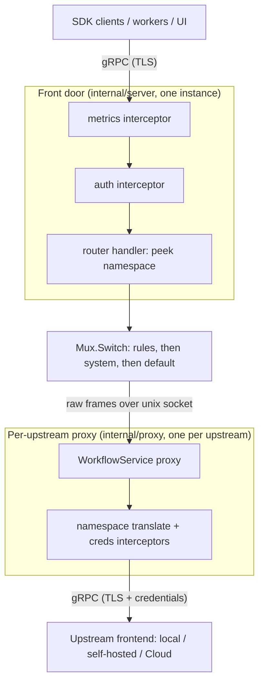

# Temporal Proxy ([Pre-release])

[](https://github.com/temporalio/temporal-proxy/actions/workflows/ci.yaml)
[](https://codecov.io/gh/temporalio/temporal-proxy)
[](https://pkg.go.dev/github.com/temporalio/temporal-proxy)
[](LICENSE)

A gRPC proxy that sits between Temporal SDK clients, workers, and the Temporal UI on one side and one or more upstream
Temporal clusters on the other. It handles namespace translation and TLS termination so applications can target a single
local endpoint while the proxy fans requests out to the right upstream (a local dev cluster, a self-hosted deployment,
Temporal Cloud, or some mix).

> [!NOTE]
>
> **Pre-release:** This project is under active development and evolving quickly. It is not ready for production use.
> Open a GitHub issue if you have questions or want to follow along.

## Installation

> [!NOTE]
>
> Releases are currently pre-release (alpha), so most tooling will not select them without opting in. The examples below
> show how.

### Go

Install the `proxy` binary into your `$GOBIN` with `go install`:

```bash
go install github.com/temporalio/temporal-proxy/cmd/proxy@latest
```

Since only pre-release tags exist today, `@latest` resolves to the current alpha. Pin an explicit version if you prefer:

```bash
go install github.com/temporalio/temporal-proxy/cmd/proxy@v0.1.0-alpha.20260716
```

### Container image

Images are published to [Docker Hub](https://hub.docker.com/r/temporalio/temporal-proxy):

```bash
docker pull temporalio/temporal-proxy:latest
```

### Helm

A chart is published to the Temporal Helm repo at `https://go.temporal.io/helm-charts`. Because the chart is a
pre-release, opt in with `--devel` or pin an explicit `--version`:

```bash
# Latest pre-release
helm install temporal-proxy temporal-proxy \
  --repo https://go.temporal.io/helm-charts \
  --devel

# Or pin a specific version
helm install temporal-proxy temporal-proxy \
  --repo https://go.temporal.io/helm-charts \
  --version 0.1.0-alpha1
```

The chart deploys the proxy as a single Deployment fronted by a ClusterIP Service, with its runtime configuration
supplied through a ConfigMap (mounted at `/etc/temporal-proxy/config.yaml`). Set that config under `config` in your
values. See the [chart README](https://github.com/temporalio/helm-charts/tree/main/charts/temporal-proxy) for the full
set of options.

## How It Works

The proxy is really **two gRPC servers connected by a unix socket**:

- A single **front door** (`internal/server`) that every worker, SDK client, and the UI connect to. It is
  codec-transparent: it never parses payloads. It peeks the namespace off the first frame, picks an upstream, and relays
  raw frames in both directions.
- One **per-upstream proxy** (`internal/proxy`) for each configured upstream, each listening on its own unix socket.
  This hop hosts a real `WorkflowService` proxy, applies namespace translation and outbound credentials, and dials the
  actual upstream frontend.

Routing happens at the front door; namespace translation and outbound auth happen in the per-upstream proxy. Whether an
upstream is a local dev cluster, a self-hosted deployment, or Temporal Cloud is purely a matter of that upstream's
config (TLS, credentials, translation rules). There is no first-class "local vs Cloud" concept.



### The request path

1. **Connect.** A worker dials the front door over gRPC (TLS, mTLS, or insecure, per the `listen` config).
2. **Metrics.** A stream interceptor starts timing and will record request duration and final gRPC status code, labeled
   by method (never by namespace).
3. **Authenticate.** The inbound authenticator validates the configured credential (static token or JWKS). On success it
   strips the consumed credential header so it never leaks upstream; on failure it returns a client-safe status and logs
   the detail server-side. Auth is opt-in: with no `auth` block, every request is admitted.
4. **Peek and route.** The router buffers the first client frame, reads the namespace via protoreflect, and `Mux.Switch`
   picks an upstream. The first matching rule wins, then the system upstream (empty namespace), then the default.
5. **Forward.** The front door opens a stream to the chosen upstream's unix socket, replays the buffered frame, and
   pumps frames in both directions using a pass-through codec. Headers, trailers, and status are relayed verbatim.
6. **Translate and authenticate outbound.** In the per-upstream proxy, client interceptors rewrite the local namespace
   to the remote one (`prefix + namespace + suffix`, or an explicit override) on the way out and back to the local name
   on the way in, and attach the upstream's credential (which requires TLS).
7. **Upstream.** The proxy dials the real Temporal frontend. The response retraces the same path in reverse.

### Namespace translation

Workers address namespaces by their local name, but an upstream may know them by a different name (for example, Temporal
Cloud registers `payments` as `payments.<account>`). Each upstream configures translation rules (a `prefix`, a `suffix`,
and/or explicit `overrides`), and the proxy rewrites namespace fields in both requests and responses. Rewriting is
driven by protoreflect: any string field whose name ends in `namespace` is translated (plus a few explicit fields such
as `NamespaceInfo.name`), and a per-type plan is cached so the descriptor walk happens once per message type.

### Configuration

Config is a single YAML file (passed via `--config` or `PROXY_CONFIG`) with `${VAR}` environment expansion. The shape,
abbreviated:

```yaml
hostPort: 0.0.0.0:7233 # front-door listener
tls: { ca, cert, key, serverName }

auth: # inbound, optional
  staticToken: { token, header, scheme } # or jwks: { url, audiences, issuer, ... }

routing:
  default: local # fallback upstream
  system: local # used for namespace-less requests
  rules:
    - upstream: cloud
      match: { namespace: "payments*" }

upstreams:
  - name: local
    hostPort: localhost:7234
  - name: cloud
    hostPort: my-ns.acct.tmprl.cloud:7233
    tls: { serverName: my-ns.acct.tmprl.cloud }
    namespaces:
      rules: { suffix: ".acct" }
    credentials:
      static: { apiKey: "${TEMPORAL_API_KEY}" }
```

> [!NOTE]
>
> The front door serves all traffic through a catch-all handler and labels metrics by gRPC method, which is effectively
> unbounded. The proxy assumes trusted callers; do not expose it to untrusted clients without additional protection.

## Development

See [`.github/CONTRIBUTING.md`](.github/CONTRIBUTING.md) for the dev loop. The common entry points are `mise run test`,
`mise run lint`, and `mise run format`.

## Security

See [`SECURITY.md`](SECURITY.md) for how to report vulnerabilities.

## License

MIT, see [`LICENSE`](LICENSE).

[Pre-release]: https://docs.temporal.io/evaluate/development-production-features/release-stages
