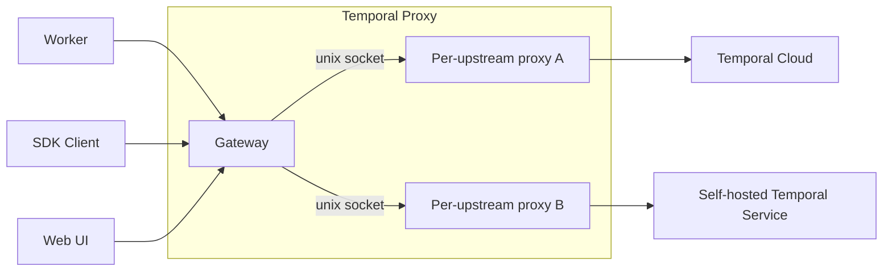

# Temporal Proxy ([Pre-release])

[](https://github.com/temporalio/temporal-proxy/actions/workflows/ci.yaml)
[](https://codecov.io/gh/temporalio/temporal-proxy)
[](https://pkg.go.dev/github.com/temporalio/temporal-proxy)
[](LICENSE)

A gRPC proxy that sits between Temporal SDK Clients, Workers, and the Temporal UI on one side and one or more upstream
Temporal Services on the other. It handles Namespace translation and TLS termination so applications can target a single
local endpoint while the proxy fans requests out to the right upstream (a local dev Temporal Service, a self-hosted
deployment, Temporal Cloud, or some mix).

> [!NOTE]
>
> **Pre-release:** This project is under active development and evolving quickly. It is not ready for production use.
> Open a GitHub issue if you have questions or want to follow along.

## Why

Connection details leak into application code. Every Worker and Client has to know the upstream's host, TLS material,
credentials, and the exact Namespace name the upstream expects. That couples your code to an environment and makes
moving between a local Temporal Service, a self-hosted deployment, and Temporal Cloud a code change.

The proxy pulls that concern out. Workers talk plaintext to a single local endpoint using a short Namespace name; the
proxy owns TLS, credentials, and Namespace translation on the way out. Point a Worker at a different Namespace and it
reaches a different upstream with no change to the Worker.

## How



## Features

- **Rule-based routing.** Route requests to different upstreams by Namespace and/or request metadata, with a system
  upstream for Namespace-less calls and a default fallback.
- **Namespace translation.** Rewrite local Namespace names to the names an upstream expects (prefix, suffix, or explicit
  overrides) in both requests and responses.
- **TLS termination and outbound credentials.** Terminate inbound TLS/mTLS and attach the upstream's own TLS and
  credentials (API key or mTLS), so client code carries none of it.
- **Inbound authentication.** Optional static-token or JWKS validation on the gateway; off by default.
- **Codec-transparent.** The gateway never parses payloads. It peeks the Namespace, picks an upstream, and relays raw
  frames in both directions.
- **Multiple deployment options.** Ship as a Go binary, a container image, or a Helm chart.

## Installation

### Go

Install the `proxy` binary into your `$GOBIN` with `go install`:

```bash
go install github.com/temporalio/temporal-proxy/cmd/proxy@latest
```

`@latest` resolves to the newest stable release. Pin an explicit version if you prefer:

```bash
go install github.com/temporalio/temporal-proxy/cmd/proxy@v0.1.0
```

### Container image

Images are published to [Docker Hub](https://hub.docker.com/r/temporalio/temporal-proxy):

```bash
docker pull temporalio/temporal-proxy:latest
```

### Helm

A chart is published to the Temporal Helm repo at `https://go.temporal.io/helm-charts`:

```bash
# Latest stable release
helm install temporal-proxy temporal-proxy \
  --repo https://go.temporal.io/helm-charts

# Or pin a specific proxy version
helm install temporal-proxy temporal-proxy \
  --repo https://go.temporal.io/helm-charts \
  --set image.tag=v0.1.0
```

Each chart release deploys a proxy version by default; `--set image.tag` overrides it to pin a specific one.

Supply the proxy config under the `config:` key in a values file and pass it with `-f`:

```yaml
# values.yaml
config:
  hostPort: :7233
  upstreams:
    - name: local
      hostPort: localhost:7234
  routing:
    default: local
```

```bash
helm install temporal-proxy temporal-proxy \
  --repo https://go.temporal.io/helm-charts \
  -f values.yaml
```

See the [chart README] for the full set of options.

[chart README]: https://github.com/temporalio/helm-charts/tree/main/charts/temporal-proxy

## Get started

The [Temporal Cloud example](examples/cloud) is the quickest way to see the proxy in action: a Worker and starter that
carry no Cloud configuration talk plaintext to `localhost:7233`, and the proxy adds TLS, the API key, and the Namespace
rewrite on the way to Cloud. Follow its README to run it end to end.

## Terms

| Term             | Meaning                                                                                                                                                                                        |
| ---------------- | ---------------------------------------------------------------------------------------------------------------------------------------------------------------------------------------------- |
| gateway          | The single inbound gRPC endpoint that every SDK Client, Worker, and the UI connects to. It routes each request to an upstream by Namespace and/or request metadata, and never parses payloads. |
| upstream         | A configured destination the proxy forwards to: a Temporal Service (local dev, self-hosted, or Temporal Cloud), or another Temporal Proxy.                                                     |
| system upstream  | The upstream that handles Namespace-less requests, such as the SDK's `GetSystemInfo` call on connect.                                                                                          |
| Temporal Service | A Temporal frontend the proxy connects to.                                                                                                                                                     |

## Development

See [`.github/CONTRIBUTING.md`](.github/CONTRIBUTING.md) for the dev loop. The common entry points are `mise run test`,
`mise run lint`, and `mise run format`.

## Security

See [`SECURITY.md`](SECURITY.md) for how to report vulnerabilities.

## License

MIT, see [`LICENSE`](LICENSE).

[Pre-release]: https://docs.temporal.io/evaluate/development-production-features/release-stages
