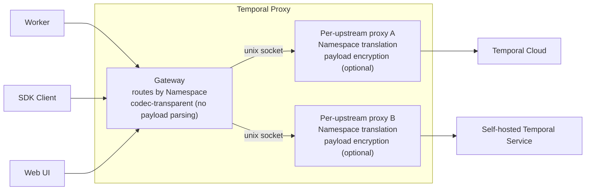

# Temporal Proxy ([Pre-release])

[](https://github.com/temporalio/temporal-proxy/actions/workflows/ci.yaml)
[](https://codecov.io/gh/temporalio/temporal-proxy)
[](https://github.com/temporalio/temporal-proxy/releases)
[](https://docs.temporal.io/production-deployment/temporal-proxy/)
[](https://pkg.go.dev/github.com/temporalio/temporal-proxy)
[](LICENSE)

A gRPC proxy that sits between Temporal SDK Clients, Workers, and the Temporal UI on one side and one or more upstream
Temporal Services on the other. It handles Namespace translation, TLS termination, and payload encryption so
applications can target a single local endpoint while the proxy fans requests out to the right upstream (a local dev
Temporal Service, a self-hosted deployment, Temporal Cloud, or some mix).

> [!NOTE]
>
> **Pre-release:** This project is under active development and evolving quickly. It is not ready for production use.
> Open a GitHub issue if you have questions or want to follow along.

## Why

Connection details leak into application code. Every Worker and Client has to know the upstream's host, TLS material,
credentials, and the exact Namespace name the upstream expects. That couples your code to an environment and makes
moving between a local Temporal Service, a self-hosted deployment, and Temporal Cloud a code change.

The proxy pulls that concern out. Workers talk plaintext to a single local endpoint using a short Namespace name; the
proxy owns TLS, credentials, and Namespace translation on the way out. Point a Worker at a different Namespace and it
reaches a different upstream with no change to the Worker.

## How


```mermaid
  flowchart LR
    Worker[Worker]
    Client[SDK Client]
    UI[Web UI]

    subgraph Proxy[Temporal Proxy]
        direction LR
        Gateway["Gateway<br/>routes by Namespace<br/>codec-transparent (no payload parsing)"]
        ProxyA["Per-upstream proxy A<br/>Namespace translation<br/>payload encryption (optional)"]
        ProxyB["Per-upstream proxy B<br/>Namespace translation<br/>payload encryption (optional)"]
        Gateway -->|unix socket| ProxyA
        Gateway -->|unix socket| ProxyB
    end

    Cloud[Temporal Cloud]
    SelfHosted[Self-hosted Temporal Service]

    Worker --> Gateway
    Client --> Gateway
    UI --> Gateway
    ProxyA --> Cloud
    ProxyB --> SelfHosted
```

## Features

- **Rule-based routing.** Route requests to different upstreams by Namespace and/or request metadata, with a system
  upstream for Namespace-less calls and a default fallback.
- **Namespace translation.** Rewrite local Namespace names to the names an upstream expects (prefix, suffix, or explicit
  overrides) in both requests and responses.
- **TLS termination and outbound credentials.** Terminate inbound TLS/mTLS and attach the upstream's own TLS and
  credentials (API key or mTLS), so client code carries none of it.
- **Payload encryption.** Optionally seal payloads with envelope encryption on the hop to an upstream and open them on
  responses, so the upstream only ever sees ciphertext while local Workers keep exchanging cleartext. DEKs are wrapped
  by a KMS key (AWS KMS, Azure Key Vault, or GCP KMS), rotate automatically, and can be overridden per Namespace.
- **Pluggable key management.** For a backend the proxy has no built-in support for, such as an on-prem HSM or an
  internal key service, point it at an extension server you run and it wraps DEKs through that instead. Only key
  material is exchanged; payloads never reach it.
- **Inbound authentication.** Optional static-token or JWKS validation on the gateway; off by default. For an identity
  system neither covers, delegate the decision to an extension server you run and it admits or refuses each caller.
- **Codec-transparent.** The gateway never parses payloads. It peeks the Namespace, picks an upstream, and relays raw
  frames in both directions.
- **Configurable service exposure.** By default the proxy forwards `WorkflowService` and `OperatorService`, the pair a
  normal Client, Worker, CLI, or UI needs, and answers named health checks for exactly that set. `allowedServices` makes
  the exposed set explicit, including opting in to gRPC server reflection.
- **Multiple deployment options.** Ship as a Go binary, a container image, or a Helm chart.

## Installation

### Go

Install the `proxy` binary into your `$GOBIN` with `go install`:

```bash
go install github.com/temporalio/temporal-proxy/cmd/proxy@latest
```

`@latest` resolves to the newest stable release. Pin an explicit version from the
[releases page](https://github.com/temporalio/temporal-proxy/releases) if you prefer:

```bash
go install github.com/temporalio/temporal-proxy/cmd/proxy@vX.Y.Z
```

### Container image

Images are published to [Docker Hub](https://hub.docker.com/r/temporalio/temporal-proxy):

```bash
docker pull temporalio/temporal-proxy:latest
```

### Helm

A chart is published to the Temporal Helm repo at `https://go.temporal.io/helm-charts`:

```bash
# Latest stable release
helm install temporal-proxy temporal-proxy \
  --repo https://go.temporal.io/helm-charts

# Or pin a specific proxy version (see the releases page)
helm install temporal-proxy temporal-proxy \
  --repo https://go.temporal.io/helm-charts \
  --set image.tag=vX.Y.Z
```

Each chart release deploys a proxy version by default; `--set image.tag` overrides it to pin a specific one.

Supply the proxy config under the `config:` key in a values file and pass it with `-f`:

```yaml
# values.yaml
config:
  hostPort: :7233
  # Optional. Omit this key for the default: WorkflowService and OperatorService,
  # the pair a normal Client, Worker, CLI, or UI needs. An explicit list REPLACES
  # that default rather than extending it, so listing only OperatorService here
  # would refuse WorkflowService too. gRPC server reflection is opt-in; add
  # grpc.reflection.v1.ServerReflection to expose it.
  # allowedServices:
  #   - temporal.api.workflowservice.v1.WorkflowService
  #   - temporal.api.operatorservice.v1.OperatorService
  upstreams:
    - name: local
      hostPort: localhost:7234
  routing:
    default: local
```

```bash
helm install temporal-proxy temporal-proxy \
  --repo https://go.temporal.io/helm-charts \
  -f values.yaml
```

See the [chart README] for the full set of options.

[chart README]: https://github.com/temporalio/helm-charts/tree/main/charts/temporal-proxy

## Get started

The [Temporal Cloud example](examples/cloud) is the quickest way to see the proxy in action: a Worker and starter that
carry no Cloud configuration talk plaintext to `localhost:7233`, and the proxy adds TLS, the API key, and the Namespace
rewrite on the way to Cloud. Follow its README to run it end to end.

The [KMS extension server example](examples/kms) shows the pluggable key management path end to end: a local dev server,
a key provider you run, and workflow payloads that the Temporal Service only ever stores as ciphertext. It is built on
[`pkg/ext`](pkg/ext), which supplies the gRPC surface, the credential check, TLS, and graceful shutdown, so writing your
own extension server means implementing the key handling and little else.

## Terms

| Term             | Meaning                                                                                                                                                                                        |
| ---------------- | ---------------------------------------------------------------------------------------------------------------------------------------------------------------------------------------------- |
| gateway          | The single inbound gRPC endpoint that every SDK Client, Worker, and the UI connects to. It routes each request to an upstream by Namespace and/or request metadata, and never parses payloads. |
| upstream         | A configured destination the proxy forwards to: a Temporal Service (local dev, self-hosted, or Temporal Cloud), or another Temporal Proxy.                                                     |
| system upstream  | The upstream that handles Namespace-less requests, such as the SDK's `GetSystemInfo` call on connect.                                                                                          |
| extension server | A gRPC service you run that the proxy calls out to for a capability it has no built-in backend for: wrapping DEKs, or admitting inbound callers. Build one with [`pkg/ext`](pkg/ext).          |
| Temporal Service | A Temporal frontend the proxy connects to.                                                                                                                                                     |

## Development

See [`.github/CONTRIBUTING.md`](.github/CONTRIBUTING.md) for the dev loop. The common entry points are `mise run test`,
`mise run lint`, and `mise run format`.

## Security

See [`SECURITY.md`](SECURITY.md) for how to report vulnerabilities.

## License

MIT, see [`LICENSE`](LICENSE).

[Pre-release]: https://docs.temporal.io/evaluate/development-production-features/release-stages
