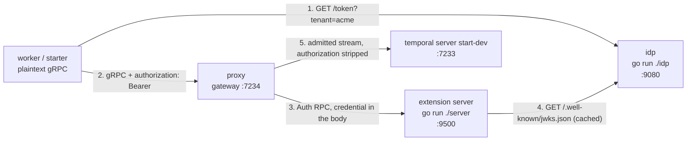

# Inbound authentication extension server example

This example authenticates the workers that connect to the proxy. Every inbound stream has to present a JWT, and the
proxy asks a small gRPC service you run yourself, an extension server, whether to admit it. That service verifies the
token's signature against a live JWKS and then applies one rule the proxy's built-in authenticators cannot express: the
token's `tenant` claim has to name a tenant it serves.



## Prerequisites

- Go and a checkout of this repository; the proxy and the example both run from source.
- The `temporal` CLI, for the dev server and for probing the gateway.
- No cloud account and no credentials: everything here runs on localhost.

Everything under `examples` is one Go module, and its `go.mod` builds the proxy from this working tree with a `replace`
directive. If you copy this example into another tree, drop that line and require a released proxy version instead.

## Run

Five terminals, and **the order matters**. Each process refuses to start without the one before it: the extension
server fetches the JWKS at startup and exits if it cannot, and the proxy opens its extension server and upstream
connections while starting up rather than lazily.

Terminal 1, the dev server. The proxy will not finish starting without it, because it verifies its upstream is reachable
before it serves:

```bash
temporal server start-dev
```

Terminal 2, in `examples/auth`, the stand-in identity provider:

```bash
go run ./idp
```

```text
2026/08/04 16:11:03 idp listening on 127.0.0.1:9080 (kid=t2ABMxROFJreGu8nN6z_R9W9TMGVYgWlCWga8LfJs7k iss=http://127.0.0.1:9080/ aud=temporal-proxy)
```

The key is generated in memory at startup, so your `kid` will differ, and restarting this process rotates it.

Terminal 3, in `examples/auth`, the extension server:

```bash
go run ./server
```

```text
{"level":"info","component":"examples","jwks":"http://127.0.0.1:9080/.well-known/jwks.json","issuer":"http://127.0.0.1:9080/","audience":"temporal-proxy","tenants":"acme,globex","time":"2026-08-04T16:11:25-04:00","message":"Verifying tokens"}
{"level":"info","component":"examples","addr":"127.0.0.1:9500","time":"2026-08-04T16:11:25-04:00","message":"Starting extension server"}
```

Terminal 4, from the repository root, the proxy:

```bash
go run ./cmd/proxy serve -c examples/auth/config.yaml
```

```text
{"level":"info","component":"metrics","addr":":9090","time":"2026-08-04T16:11:48-04:00","message":"Starting metrics server"}
{"level":"warn","addr":"/var/folders/6m/x_q_q9nx6ns3ygnf48xzqrn80000gn/T/127-0-0-1-7233-6689a1b6.sock","time":"2026-08-04T16:11:48-04:00","message":"Running with insecure credentials. Configure TLS for production use."}
{"level":"info","addr":"/var/folders/6m/x_q_q9nx6ns3ygnf48xzqrn80000gn/T/127-0-0-1-7233-6689a1b6.sock","time":"2026-08-04T16:11:48-04:00","message":"Starting the server"}
{"level":"warn","addr":"127.0.0.1:7234","time":"2026-08-04T16:11:48-04:00","message":"Running with insecure credentials. Configure TLS for production use."}
{"level":"info","addr":"127.0.0.1:7234","time":"2026-08-04T16:11:48-04:00","message":"Starting the server"}
```

Both `Running with insecure credentials` warnings describe plaintext hops on this machine, an internal socket and the
gateway itself. They say nothing about whether callers are authenticated; that is the subject of this example and it is
switched on.

Terminal 5, in `examples/auth`, the worker:

```bash
go run ./worker
```

```text
2026/08/04 16:13:57 worker listening on task queue "auth-example" (namespace "default", tenant "acme")
```

With all five running, start the workflow from `examples/auth`:

```bash
go run ./starter
```

```text
2026/08/04 16:14:14 starting workflow as tenant "acme"
2026/08/04 16:14:14 started workflow id=auth-example-greeting runID=019fce69-96fe-7cbd-9152-c8dd87e00001
Hello, Temporal!
```

Your run ID and timestamps will differ.

## What just happened

Follow one credential. The worker asked the identity provider for a token carrying `tenant: acme` and sent it to the
gateway as an ordinary `authorization: Bearer <jwt>` header. For each stream the proxy then:

1. lifted that header out of the stream into the `AuthRequest` body, and withheld it from the metadata it forwarded to
   the extension server, so the extension server reads the caller's credential from a field the proxy vouches for
   rather than from metadata it would have to tell apart from its own;
2. called the extension server, which verified the signature against the cached JWKS, checked `exp`, `iss` and `aud`,
   and confirmed `acme` was a tenant it serves;

   ```text
   {"level":"info","component":"examples","sub":"worker","tenant":"acme","time":"2026-08-04T16:37:30-04:00","message":"Admitted a caller"}
   ```

3. stripped `authorization` from the stream it forwarded to the dev server.

That last step is worth checking rather than believing. Reach the dev server directly, with no credential at all, and
the execution is there:

```bash
env -u TEMPORAL_API_KEY temporal workflow list --address 127.0.0.1:7233 --namespace default
```

```text
   Status         WorkflowId              Type          StartTime
  Completed  auth-example-greeting  GreetingWorkflow  11 seconds ago
```

The token authenticated the caller to the proxy and went no further. The dev server never needed one, and never saw
one.

> [!NOTE]
>
> If `TEMPORAL_API_KEY` is set in your shell, the CLI turns on TLS and the commands here fail with
> `tls: first record does not look like a TLS handshake`. Unset it for this shell, or prefix each command with
> `env -u TEMPORAL_API_KEY` as above.

## Why not the built-in authenticator

Most of what the extension server does, the proxy already does on its own. Point `auth.jwks` at a JWKS in
`config.yaml` and you get signature verification, an algorithm allowlist, `exp`, `iss` and `aud`, with none of your
code to maintain.

The one thing it cannot do is decide on a claim the proxy has never heard of. `tenant` is not a registered JWT claim
and means nothing to the proxy, so no amount of configuration expresses "admit `acme` and `globex`, refuse everyone
else". That rule is the only reason this server exists.

What you take on by writing it yourself is worth knowing before you do:

- the JWKS fetch, its cache, and its refresh cadence;
- the signing method allowlist, which is a security control and not a detail (an unpinned algorithm accepts `none`);
- the error taxonomy in the next section, which is easy to get wrong in a way nobody notices until an outage.

If you do not need a custom claim, use the built-in.

## How the verifier works

`server/verifier.go` is the whole decision, and the part you replace. It returns three codes, and they are not
interchangeable:

| Condition | Code | Why |
| --- | --- | --- |
| Credential absent, repeated, not `Bearer`, bad signature, expired, wrong `iss` or `aud` | `Unauthenticated` | The credential is broken. Get a new one. |
| Valid token, `tenant` missing or not served | `PermissionDenied` | The token is fine. A new one will not help. |
| The JWKS could not be consulted | `Unavailable` | An availability problem, not a bad token. Retry. |

Collapsing the first two sends every refused caller into a token refresh loop that cannot succeed. Collapsing the
second two tells a caller holding a perfectly good token to go and replace it.

The proxy keeps the code and discards the message. A refused caller sees:

```text
2026/08/04 16:38:01 dial proxy: failed reaching server: caller is not permitted
```

and nothing about which tenant, or that a tenant was even involved. The reason lives in the extension server's log:

```text
{"level":"info","component":"examples","sub":"starter","tenant":"hooli","time":"2026-08-04T16:38:01-04:00","message":"Refused a tenant"}
```

and, with the code, in the proxy's:

```text
{"level":"warn","method":"/temporal.api.workflowservice.v1.WorkflowService/GetSystemInfo","code":"PermissionDenied","reason":"external auth: tenant not permitted: hooli","time":"2026-08-04T16:38:01-04:00","message":"inbound authentication rejected"}
```

That split is deliberate: the message an extension server writes is for whoever operates it, and may name internal
systems, so the proxy does not forward it to the caller it just turned away. Look in the extension server's log first.

## When it breaks

**A tenant that is not served.** The clearest failure, and a one-liner:

```bash
AUTH_TENANT=hooli go run ./starter
```

```text
2026/08/04 16:38:01 dial proxy: failed reaching server: caller is not permitted
exit status 1
```

It fails on `dial`, not on starting the workflow: the SDK calls `GetSystemInfo` while connecting, and that stream is
authenticated like any other. No execution is created.

**The identity provider is unreachable.** This one never reaches the proxy, and the message says so:

```bash
AUTH_IDP_URL=http://127.0.0.1:9999 go run ./starter
```

```text
2026/08/04 16:13:12 dial proxy: failed reaching server: fetch token from http://127.0.0.1:9999 (is the idp running?): Get "http://127.0.0.1:9999/token?tenant=acme": dial tcp 127.0.0.1:9999: connect: connection refused
```

**An expired token.** You will not see this from the worker or the starter, because they refresh: a token is replaced
once it is within a minute of expiry, so even `AUTH_TTL=1s` keeps working by minting a fresh one for every call. To see
the rejection you have to present a stale token deliberately:

```bash
TOK=$(curl -s 'http://127.0.0.1:9080/token?tenant=acme&sub=probe&ttl=2s' | \
  python3 -c 'import json,sys; print(json.load(sys.stdin)["access_token"])')
sleep 5
env -u TEMPORAL_API_KEY temporal workflow list --address 127.0.0.1:7234 --namespace default \
  --api-key "$TOK" --tls=false
```

```text
Error: failed reaching server: rpc error: code = Unauthenticated desc = invalid credentials
```

```text
{"level":"info","component":"examples","error":"token has invalid claims: token is expired","time":"2026-08-04T16:18:43-04:00","message":"Rejected a token"}
```

That `--api-key` with `--tls=false` is a handy way to probe the gateway with any token you like.

**The extension server dies while the proxy is running.** The proxy fails closed: it denies rather than admitting while
it cannot ask.

```text
Error: failed reaching server: authentication temporarily unavailable
```

```text
{"level":"warn","method":"/temporal.api.workflowservice.v1.WorkflowService/GetSystemInfo","code":"Unavailable","reason":"external auth: connection error: desc = \"transport: Error while dialing: dial tcp 127.0.0.1:9500: connect: connection refused\"","time":"2026-08-04T16:18:57-04:00","message":"inbound authentication rejected"}
```

**The extension server is down when the proxy starts.** It does not start at all, which is why the run order above
matters:

```text
{"level":"error","error":"extension server connection not ready: 127.0.0.1:9500: not ready (last state: TRANSIENT_FAILURE): context deadline exceeded","time":"2026-08-04T16:36:02-04:00","message":"Failed to start"}
exit status 1
```

**A rotated signing key**, which is the subtle one. Restart the identity provider while the worker keeps running. It
generates a new key, so the worker's token is now signed by a key the JWKS no longer publishes, and yet the worker
keeps being admitted:

```text
{"level":"info","component":"examples","sub":"worker","tenant":"acme","time":"2026-08-04T16:15:14-04:00","message":"Admitted a caller"}
```

Nothing is broken. The extension server holds the old key in its JWKS cache and refreshes on a 15 minute cadence, so a
rotated key keeps verifying until that cache turns over. **A revoked key stays usable for up to the refresh interval**,
which is the reason the cadence is 15 minutes here rather than the library's one hour default. Shorten it if that
window is too wide for you, and pay for it in fetches.

Restart the extension server to force a fresh JWKS and the rejection appears:

```text
{"level":"info","component":"examples","error":"token is unverifiable: error while executing keyfunc: key not found \"t2ABMxROFJreGu8nN6z_R9W9TMGVYgWlCWga8LfJs7k\"\nfailed keyfunc: could not read JWK from storage","time":"2026-08-04T16:16:14-04:00","message":"Rejected a token"}
```

That first rejection is `Unauthenticated`, correctly: the key is genuinely absent, so the token was signed by something
untrusted. The ones behind it are not. An unknown key id triggers an on-demand JWKS refresh, and the library rate
limits those to one every five minutes, so every stream arriving during that window fails on the rate limiter instead
of on the keyset, and the taxonomy cannot tell that apart from an unreachable JWKS:

```text
{"level":"warn","method":"/temporal.api.workflowservice.v1.WorkflowService/PollWorkflowTaskQueue","code":"Unavailable","reason":"external auth: jwks unavailable: token is unverifiable: error while executing keyfunc: failed to wait for JWK Set refresh rate limiter due to error: rate: Wait(n=1) would exceed context deadline\nfailed keyfunc: could not read JWK from storage","time":"2026-08-04T16:16:21-04:00","message":"inbound authentication rejected"}
```

So a burst of stale-key callers is told to retry rather than to get a new token. This is the conservative direction to
be wrong in, and it is the same tradeoff the proxy's own built-in authenticator makes: an infrastructure-level read
error maps to retryable rather than masquerading as a bad credential. Worth knowing it is a burst-shaped edge, not a
clean one.

## What this is not

**The identity provider is a toy.** Its key never leaves memory, so restarting it invalidates every token it ever
issued and nothing survives a reboot. More to the point, `/token` authenticates nobody: anyone who can reach port 9080
mints a token for any tenant they name. A real one issues tokens to authenticated clients and holds its keys somewhere
durable.

**The extension server is unguarded.** The proxy reaches it in plaintext with no credential, so anything that can
reach port 9500 can ask it to authenticate callers. That keeps this example's setup at zero and its subject on caller
authentication, but it is not what you would deploy. `server/main.go` carries the `ext.WithServerAuth` call commented
out, with a note on why uncommenting it is not sufficient on its own: the proxy refuses to put a credential on a
plaintext connection to an extension server, so guarding it means serving TLS here and adding `tls` and `credentials`
blocks to `config.yaml`. `examples/kms` shows that arrangement in full.

**Authentication happens per stream, and nothing caches a verdict.** Every worker poll is a new stream and therefore a
new `Auth` call. Across one run of the steps above the extension server issued 20 verdicts while the identity provider
minted 4 tokens and served 1 JWKS fetch.

Only the last of those three is stable. The verdict count depends entirely on how long the worker sat polling, so
expect a different, larger number the longer you leave it; the mint count is roughly one per process plus one per
refresh. The single JWKS fetch is the number to watch, and it stays 1 for the extension server's whole lifetime. The
per-stream cost is only tolerable because both caches are doing their job; weigh that before pointing one of these at a
slow identity backend.

## Running it again

The starter always uses the fixed workflow ID `auth-example-greeting`. Run it again after the previous run has
completed and nothing special happens: the server's default reuse policy allows a new run once the old one has closed.

The case worth knowing about is a still-open execution, for example one started while the worker was stopped. Neither
the SDK nor the CLI reports an already-started error; both attach to the open run instead, so the starter blocks
waiting for a result that will not arrive. Bring the worker back so the run can finish, clear it directly with:

```bash
env -u TEMPORAL_API_KEY temporal workflow terminate --workflow-id auth-example-greeting \
  --namespace default --address 127.0.0.1:7233
```

or restart the dev server, whose state lives entirely in memory.

Note that the gateway here listens on `127.0.0.1:7234`, the same port `examples/kms` uses, so the two examples cannot
run at the same time.
