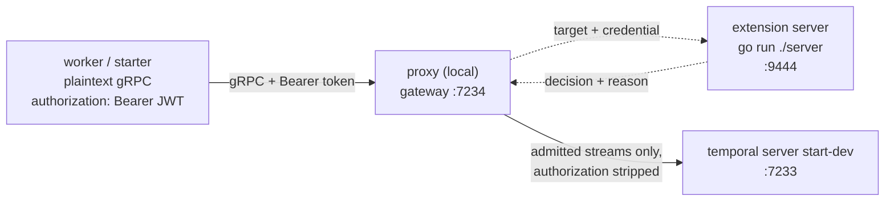

# Authorization extension server example

This example maps an incoming JWT to custom claims and then uses those claims to authorize each request, the same two
steps Temporal OSS splits across its `ClaimMapper` and `Authorizer` plugins. Here both live in a small gRPC service you
run yourself, an extension server, which the proxy asks about every stream it accepts: one RPC maps the claims and
returns the verdict.

What that buys is access decided per Namespace and per method. A Worker scoped to one Namespace cannot touch another,
and an auditor can read history but cannot start a Workflow.



The proxy holds no secret here. It knows which extension server to ask and which header carries the caller's
credential; the signing secret lives only in the extension server and in the `gentoken` command.

## Prerequisites

- Go and a checkout of this repository; the proxy and the example both run from source.
- The `temporal` CLI, for the dev server.
- No cloud account and no credentials: everything in this example runs on localhost.

Everything under `examples` is one Go module, and its `go.mod` builds the proxy from this working tree with a `replace`
directive; if you copy this example into another tree, drop that `replace` line and require a released proxy version
instead.

## Environment

```bash
export AUTHZ_JWT_SECRET=example-signing-secret
```

One secret, used in two places: `gentoken` signs tokens with it and the extension server verifies them against it. The
proxy never sees it.

## Mint the tokens

Four tokens, one command each, run from `examples/authz`. Keep them all; the walkthrough below uses every one.

```bash
export AUTHZ_WORKER=$(go run ./gentoken -sub acme-worker -ns 'default=worker,reader,writer')
export AUTHZ_AUDITOR=$(go run ./gentoken -sub acme-auditor -ns 'default=reader')
export AUTHZ_PAYMENTS=$(go run ./gentoken -sub acme-payments -ns 'payments=reader,writer')
export AUTHZ_ADMIN=$(go run ./gentoken -sub acme-admin -system admin)
```

| Token | Holds | What it can do |
| --- | --- | --- |
| `acme-worker` | `worker`, `reader`, `writer` in `default` | run a Worker and start Workflows in `default` |
| `acme-auditor` | `reader` in `default` | read history in `default`, and nothing else |
| `acme-payments` | `reader`, `writer` in `payments` | nothing in `default` |
| `acme-admin` | `admin` at the system scope | everything, in every Namespace |

`-claims` writes the token body to stderr while the token itself goes to stdout, so redirecting the token away leaves
just the claims. It is the clearest way to see what you minted:

```bash
go run ./gentoken -sub acme-worker -ns 'default=worker,reader,writer' -claims > /dev/null
```

```json
{
  "iss": "authz-example",
  "sub": "acme-worker",
  "exp": 1786648791,
  "iat": 1786645191,
  "https://acme.example/temporal": {
    "namespaces": {
      "default": [
        "worker",
        "reader",
        "writer"
      ]
    }
  }
}
```

`gentoken` stands in for the identity provider that would mint these in a real deployment, and it authenticates nobody:
anyone who can run it can mint a token granting anything.

## Run

Open four terminals. The order matters for the third one: the proxy opens its extension server connection while
starting, so start the extension server first (see "When it breaks").

Terminal 1, in `examples/authz`, starts the dev server:

```bash
temporal server start-dev
```

Terminal 2, in `examples/authz`, starts the extension server:

```bash
go run ./server
```

```text
{"level":"info","component":"examples","addr":"127.0.0.1:9444","time":"2026-08-13T15:28:20-04:00","message":"Starting extension server"}
```

On its first verdict it also warns once that it is serving in plaintext, which is the hop described under "What this
is not" and not a sign anything is wrong:

```text
{"level":"warn","component":"examples","time":"2026-08-13T15:28:42-04:00","message":"Serving in plaintext. Supply credentials via WithServerOption for production use."}
```

Terminal 3, from the repository root, starts the proxy:

```bash
go run ./cmd/proxy serve -c examples/authz/config.yaml
```

```text
{"level":"warn","addr":"/var/folders/6m/x_q_q9nx6ns3ygnf48xzqrn80000gn/T/127-0-0-1-7233-6689a1b6.sock","time":"2026-08-13T14:20:36-04:00","message":"Running with insecure credentials. Configure TLS for production use."}
{"level":"info","addr":"/var/folders/6m/x_q_q9nx6ns3ygnf48xzqrn80000gn/T/127-0-0-1-7233-6689a1b6.sock","time":"2026-08-13T14:20:36-04:00","message":"Starting the server"}
{"level":"warn","addr":"127.0.0.1:7234","time":"2026-08-13T14:20:36-04:00","message":"Running with insecure credentials. Configure TLS for production use."}
{"level":"info","addr":"127.0.0.1:7234","time":"2026-08-13T14:20:36-04:00","message":"Starting the server"}
{"level":"info","component":"metrics","addr":":9090","time":"2026-08-13T14:20:36-04:00","message":"Starting metrics server"}
```

The two `Running with insecure credentials` warnings are expected: they describe the local gateway and an internal
socket, the plaintext hops on this machine. They say nothing about whether callers are being authorized.

Terminal 4, in `examples/authz`, starts the Worker with the Worker token:

```bash
AUTHZ_TOKEN=$AUTHZ_WORKER go run ./worker
```

```text
2026/08/13 14:25:38 worker listening on task queue "authz-example" (namespace "default")
2026/08/13 14:25:38 INFO  Started Worker Namespace default TaskQueue authz-example WorkerID 63509@MutoBookPro.local@
```

With all four running, start the Workflow from `examples/authz`:

```bash
AUTHZ_TOKEN=$AUTHZ_WORKER go run ./starter
```

```text
2026/08/13 14:25:50 started workflow id=authz-example-greeting runID=019ffc5f-948b-7c3c-8502-b4a4833bcfd1
Hello, Temporal!
```

Your run ID and timestamps will differ.

## What just happened

Every stream the proxy accepted became one `Auth` RPC. The extension server's log is the whole story of the run, with
the Worker's repeated task-queue polls removed:

```text
{"level":"info","component":"examples","method":"/temporal.api.workflowservice.v1.WorkflowService/GetSystemInfo","time":"2026-08-13T14:25:38-04:00","message":"Allowed without reading a credential"}
{"level":"info","component":"examples","subject":"acme-worker","method":"/temporal.api.workflowservice.v1.WorkflowService/DescribeNamespace","namespace":"default","holds":"worker|reader|writer","time":"2026-08-13T14:25:38-04:00","message":"Allowed"}
{"level":"info","component":"examples","subject":"acme-worker","method":"/temporal.api.workflowservice.v1.WorkflowService/RecordWorkerHeartbeat","namespace":"default","holds":"worker|reader|writer","time":"2026-08-13T14:25:38-04:00","message":"Allowed"}
{"level":"info","component":"examples","method":"/temporal.api.workflowservice.v1.WorkflowService/GetSystemInfo","time":"2026-08-13T14:25:50-04:00","message":"Allowed without reading a credential"}
{"level":"info","component":"examples","subject":"acme-worker","method":"/temporal.api.workflowservice.v1.WorkflowService/StartWorkflowExecution","namespace":"default","holds":"worker|reader|writer","time":"2026-08-13T14:25:50-04:00","message":"Allowed"}
{"level":"info","component":"examples","subject":"acme-worker","method":"/temporal.api.workflowservice.v1.WorkflowService/GetWorkflowExecutionHistory","namespace":"default","holds":"worker|reader|writer","time":"2026-08-13T14:25:50-04:00","message":"Allowed"}
{"level":"info","component":"examples","subject":"acme-worker","method":"/temporal.api.workflowservice.v1.WorkflowService/RespondWorkflowTaskCompleted","namespace":"default","holds":"worker|reader|writer","time":"2026-08-13T14:25:50-04:00","message":"Allowed"}
{"level":"info","component":"examples","subject":"acme-worker","method":"/temporal.api.workflowservice.v1.WorkflowService/RespondActivityTaskCompleted","namespace":"default","holds":"worker|reader|writer","time":"2026-08-13T14:25:50-04:00","message":"Allowed"}
{"level":"info","component":"examples","subject":"acme-worker","method":"/temporal.api.workflowservice.v1.WorkflowService/RespondWorkflowTaskCompleted","namespace":"default","holds":"worker|reader|writer","time":"2026-08-13T14:25:50-04:00","message":"Allowed"}
```

Two things in there are worth pausing on.

The first call of every dial is `GetSystemInfo`, allowed without the credential being read at all. Temporal's own
authorizer allows its health-check APIs to everyone before it looks at claims, and this example mirrors that. It has a
visible consequence: a caller with no token still connects successfully, and only learns it is unwelcome on its first
real call.

Every remaining line carries a `namespace`, and it was not taken from anything the caller said about itself. The proxy
resolved it from the first request message on each stream and handed it over in the request's target, so a caller cannot
widen its own access by sending a header.

## The token, and the claims it maps to

Permissions arrive in `https://acme.example/temporal`, a vendor-namespaced private claim. Nothing the proxy ships can
read it, which is the whole reason this extension server exists: the built-in `jwks` authenticator verifies a token and
stops there, and every caller it admits can reach everything the proxy forwards.

The extension server verifies the signature (HS256, pinned), requires `exp`, requires `iss`, and then maps the claim
into the model Temporal's server uses:

```go
claims{
    subject:    "acme-worker",
    system:     roleUndefined,
    namespaces: map[string]role{"default": roleWorker | roleReader | roleWriter},
}
```

Roles are a bitmask, so they combine, and system roles apply in every Namespace. A role name the server does not
recognize is logged and skipped rather than failing the token, which is what Temporal's own JWT claim mapper does with a
permission it cannot parse. That is forgiving in a way you can see. Mint a token with `writer` deliberately misspelled:

```bash
# "wrtier" is a typo on purpose. The token verifies, the bad role is dropped,
# and the caller is left holding only "reader".
AUTHZ_TOKEN=$(go run ./gentoken -sub acme-typo -ns 'default=reader,wrtier') go run ./starter
```

```text
{"level":"warn","component":"examples","role":"wrtier","scope":"default","time":"2026-08-13T14:24:54-04:00","message":"Ignoring unrecognized role"}
{"level":"warn","component":"examples","subject":"acme-typo","method":"/temporal.api.workflowservice.v1.WorkflowService/StartWorkflowExecution","namespace":"default","holds":"reader","needs":"writer","time":"2026-08-13T14:24:54-04:00","message":"Denied"}
```

## The two halves

`server/claims.go` is the ClaimMapper half. It verifies the token and turns the claim into roles, and knows nothing
about what the caller is trying to reach.

`server/authorizer.go` is the Authorizer half, and it is where the policy lives. It is a port of Temporal's
`defaultAuthorizer`, in the same order:

1. If the method is one every caller needs, allow it, before the credential is read.
2. Turn the credential into claims, or fail.
3. Look up what the method costs.
4. `have := claims.system | claims.namespaces[namespace]` for a Namespace-scoped method, `claims.system` alone for a
   cluster-scoped one.
5. Allow when `have >= need`.

The parts of that which are the same in every provider come from `pkg/ext`, so they are not in this example to read:
`ext.BearerToken` pulls the token off the credential header and refuses a repeated value rather than picking one,
`ext.IsHealthCheckMethod` reports whether a method is in step 1's set, and `ext.Allow` and `ext.Deny` build the verdict.
The last two are worth using rather than building an `AuthResponse` by hand, because a response with no decision set
denies: by hand, you can refuse a caller by forgetting a field.

`ext.IsHealthCheckMethod` only reports. Admitting those methods unauthenticated is still this example's decision, made
in `authorizer.go`, which is where you would change it.

Start with `authorizer.go` if you are writing one of these. Its method table is the part you will replace.

## What each method costs

The table maps a gRPC method to the scope it acts in and the access it calls for, with Temporal's own values:
read-only needs `reader`, write needs `writer`, anything else needs `admin`.

A method the table does not list is charged as cluster-scoped admin, so a gap denies a caller rather than waving it
through. That default is load bearing, and it fires in practice: the first version of this example was missing
`RecordWorkerHeartbeat`, and the Worker complained on startup while everything else kept working.

```text
2026/08/13 14:20:59 WARN  Failed to send heartbeat Error caller is not permitted
```

The table is a subset. It covers what the Go SDK exercises, plus a few neighbours that make the model legible, and the
unlisted majority of the API requires admin. Temporal does not maintain a list like this; it derives the same
information for every method from `go.temporal.io/server/common/api`'s method metadata, which is where to look if you
want completeness. This example writes the entries out instead, because the table is the thing worth reading.

Two of Temporal's behaviours are kept as they are rather than quietly improved on:

- **The `worker` role grants nothing on its own.** Polling a task queue is a write, so it needs `writer`. And because
  the comparison is `>=` over a bitmask, `worker` (1) sorts below `reader` (2), so a token holding only `worker` cannot
  do anything at all. It is in the model, and the default authorizer never asks for it.
- **`>=` is an ordering test, not a mask test.** `reader|writer` (6) satisfies a `writer` (4) requirement, and `admin`
  alone (8) satisfies everything without holding any other role.

## Where a rejection's reason lives

Run the starter with the auditor's read-only token:

```bash
AUTHZ_TOKEN=$AUTHZ_AUDITOR go run ./starter
```

The caller is told almost nothing:

```text
2026/08/13 14:23:22 start workflow: caller is not permitted
```

The extension server knows exactly what happened:

```text
{"level":"warn","component":"examples","subject":"acme-auditor","method":"/temporal.api.workflowservice.v1.WorkflowService/StartWorkflowExecution","namespace":"default","holds":"reader","needs":"writer","time":"2026-08-13T14:23:22-04:00","message":"Denied"}
```

And so does the proxy, because the decision carried a reason:

```text
{"level":"warn","method":"/temporal.api.workflowservice.v1.WorkflowService/StartWorkflowExecution","code":"PermissionDenied","reason":"external auth: subject \"acme-auditor\" holds reader in namespace default, and /temporal.api.workflowservice.v1.WorkflowService/StartWorkflowExecution calls for writer","time":"2026-08-13T14:23:22-04:00","message":"inbound authentication rejected"}
```

That asymmetry is deliberate. A refused caller learns that it was refused, and nothing about the policy that refused
it. Write the reason for whoever operates the server, because that is who reads it: it may name subjects and internal
systems, and it never reaches the caller.

## When it breaks

**A token for the wrong Namespace.** The `payments` token is not weaker than the auditor's; it is simply irrelevant
here, and it reads as holding nothing:

```bash
AUTHZ_TOKEN=$AUTHZ_PAYMENTS go run ./starter
```

```text
{"level":"warn","method":"/temporal.api.workflowservice.v1.WorkflowService/StartWorkflowExecution","code":"PermissionDenied","reason":"external auth: subject \"acme-payments\" holds none in namespace default, and /temporal.api.workflowservice.v1.WorkflowService/StartWorkflowExecution calls for writer","time":"2026-08-13T14:23:31-04:00","message":"inbound authentication rejected"}
```

The `payments` Namespace does not even exist on the dev server, and it did not need to: the proxy refused the call
before routing it anywhere.

**An expired token.** Mint one that lasts a second, wait, and use it:

```bash
export AUTHZ_TOKEN=$(go run ./gentoken -ns 'default=reader,writer' -ttl 1s) && sleep 2 && go run ./starter
```

```text
2026/08/13 14:23:39 start workflow: rpc error: code = Unauthenticated desc = invalid credentials
```

`Unauthenticated`, not `PermissionDenied`, and the difference is the point. A credential the server could not turn into
claims at all is an authentication failure, so the caller is told to get a new token. Roles the server understood and
found insufficient are an authorization failure, and another token like this one would not help. The proxy's log has the
detail:

```text
{"level":"warn","method":"/temporal.api.workflowservice.v1.WorkflowService/StartWorkflowExecution","code":"Unauthenticated","reason":"external auth: invalid token: token has invalid claims: token is expired","time":"2026-08-13T14:23:39-04:00","message":"inbound authentication rejected"}
```

**No token at all.** Leave `AUTHZ_TOKEN` unset, which needs an `unset` of its own if you ran the expired-token case
above:

```bash
unset AUTHZ_TOKEN && go run ./starter
```

```text
2026/08/13 14:23:39 AUTHZ_TOKEN is unset: dialing with no credential
2026/08/13 14:23:39 start workflow: rpc error: code = Unauthenticated desc = invalid credentials
```

The dial succeeded. That is `GetSystemInfo` being allowed to everyone, as described above, and it is why an
unauthenticated caller gets a connection and then nothing.

```text
{"level":"warn","method":"/temporal.api.workflowservice.v1.WorkflowService/StartWorkflowExecution","code":"Unauthenticated","reason":"external auth: no credential presented on authorization","time":"2026-08-13T15:03:05-04:00","message":"inbound authentication rejected"}
```

**The extension server is not running when the proxy starts.** The proxy opens its extension server connections while
starting, so this fails immediately rather than on the first request:

```text
{"level":"error","error":"extension server connection not ready: 127.0.0.1:9444: not ready (last state: TRANSIENT_FAILURE): context deadline exceeded","time":"2026-08-13T14:26:29-04:00","message":"Failed to start"}
```

**The extension server stops while the proxy is running.** Now the proxy is up and every verdict is unreachable, so it
fails closed. Nothing is admitted, and the code says retryable rather than refused:

```text
{"level":"warn","method":"/temporal.api.workflowservice.v1.WorkflowService/PollWorkflowTaskQueue","code":"Unavailable","reason":"external auth: connection error: desc = \"transport: Error while dialing: dial tcp 127.0.0.1:9444: connect: connection refused\"","time":"2026-08-13T14:22:00-04:00","message":"inbound authentication rejected"}
```

The Worker keeps trying, which is the right thing for it to do:

```text
2026/08/13 14:21:59 WARN  Failed to poll for task. Namespace default TaskQueue authz-example WorkerID 62321@MutoBookPro.local@ WorkerType WorkflowWorker Error authentication temporarily unavailable
```

Start the extension server again and the Worker recovers on its own. An authorizer that fails open would have been
worse than one that is down.

## What this is not

This is a teaching aid, not an authorization system:

- **The signing secret is a shared HMAC secret in an environment variable.** Anything that can verify a token can also
  mint one, including a token granting system admin. A real deployment verifies asymmetric signatures against an
  identity provider's JWKS, and only the provider can sign. If that is all you need, and your rules fit signature,
  `exp`, `iss`, and `aud`, use the proxy's built-in `jwks` authenticator and write none of this.
- **Nothing is rotated and nothing is revoked.** A minted token is good until it expires, and the only bound on the
  damage is `-ttl`.
- **The method table is a subset**, as described above.
- **The proxy reaches the extension server in plaintext with no credential.** The caller's token crosses that hop in
  the clear, and anyone who reaches port 9444 can ask the server for verdicts. `ext.WithServerAuth` requires a
  credential here, but adding it alone is not enough: the proxy will not put a credential on a plaintext connection, so
  guarding this server also means serving TLS and adding `tls` and `credentials` blocks to the extension server's entry
  in `config.yaml`. The kms example shows that arrangement in full, including generating throwaway certificates.
- **Every stream is a separate `Auth` RPC**, including every Worker poll, and nothing caches a verdict. That is fine
  against an in-process check like this one and worth measuring before pointing it at a slow identity backend.

## Running it again

The starter always uses the fixed Workflow ID `authz-example-greeting`. Run it again after the previous run has
completed and you get a fresh run ID, since the dev server's default Workflow ID reuse policy allows a new run once the
old one has closed.

The case worth knowing about is a still-open execution, for example one started while the Worker was stopped, or while
the Worker's token could not poll. `ExecuteWorkflow` attaches to the open run rather than reporting an error, so the
starter blocks waiting for a result no Worker is producing. Bring a Worker back with a token that can poll, or clear
the run:

```bash
temporal workflow terminate --workflow-id authz-example-greeting --namespace default --address 127.0.0.1:7233
```

That goes straight to the dev server, bypassing the proxy, so it needs no token of its own.
