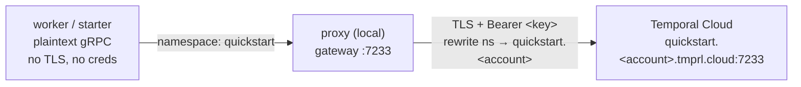

# Temporal Cloud via the proxy

Connect a worker to a Temporal Cloud namespace through the proxy using an API key. The worker and starter carry **no**
Cloud configuration: they talk plaintext to `localhost:7233`, and the proxy adds TLS, the API key, and the namespace
rewrite on the way to Cloud.



## Prerequisites

- A Temporal Cloud namespace. Note its fully-qualified name, shown in the Cloud UI as `<namespace>.<account>` (for
  example `quickstart.a1b2c`); you split it across two environment variables below. See
  [Namespaces](https://docs.temporal.io/cloud/namespaces).
- An API key, and API key authentication enabled on the namespace (namespaces default to mTLS, so this is a separate
  step). See [API keys](https://docs.temporal.io/cloud/api-keys).
- Go, and a checkout of this repository (the proxy runs from source).

## Configure

Set three environment variables. `TEMPORAL_NAMESPACE` is your namespace's short name and `TEMPORAL_ACCOUNT` is the
account id after the dot in the fully-qualified name (a namespace `quickstart.a1b2c` means
`TEMPORAL_NAMESPACE=quickstart` and `TEMPORAL_ACCOUNT=a1b2c`):

```bash
export TEMPORAL_NAMESPACE=quickstart
export TEMPORAL_ACCOUNT=a1b2c
export TEMPORAL_API_KEY=<your-api-key>
```

## Run

Open three terminals in this directory (`examples/cloud`). The proxy lives in the repository's root module, so its
command changes to the repo root and runs it from source:

```bash
cd ../../ && go run ./cmd/proxy serve -c examples/cloud/config.yaml
```

The proxy logs `Running with insecure credentials` for the local gateway and its internal sockets. That is expected:
those are local hops. The connection to Temporal Cloud is TLS.

Start the worker:

```bash
go run ./worker
```

Run the starter:

```bash
go run ./starter
```

The starter prints:

```text
Hello, Temporal!
```

The workflow execution is also visible in the Temporal Cloud UI for your namespace.

## What just happened

The worker and starter connected to the proxy on `localhost:7233` with no TLS and no credentials, using the short
namespace name `quickstart`. For each request the proxy:

1. terminated the local plaintext connection and dialed Temporal Cloud over TLS;
2. attached the API key as an `Authorization: Bearer` header; and
3. rewrote the namespace from `quickstart` to `quickstart.<account>` (and back on responses).

## How the config routes

`config.yaml` uses two upstreams, which is the pattern for reaching Temporal Cloud by namespace endpoint:

- **`cloud`** handles namespaced requests. Its `hostPort` is a template (`{{ .RemoteNamespace }}.tmprl.cloud:7233`)
  resolved per request from the translated namespace, so one config serves any number of namespaces - point more workers
  at the proxy with different namespaces and each reaches its own Cloud endpoint, no config change.
- **`system`** handles the namespace-less calls the SDK makes (for example `GetSystemInfo` on connect). With no
  namespace there is nothing to derive a host from, so this upstream uses a fixed endpoint. Any namespace endpoint in
  the account answers these calls.

> [!NOTE]
>
> With a single namespace both upstreams resolve to the same host; the split is what lets the same config scale to many.
