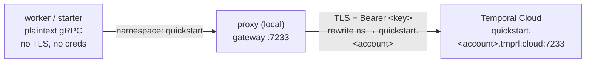

# Temporal Cloud via the proxy

Connect a Worker to a Temporal Cloud Namespace through the proxy using an API key. The Worker and starter carry **no**
Cloud configuration: they talk plaintext to `localhost:7233`, and the proxy adds TLS, the API key, and the Namespace
rewrite on the way to Cloud.


```mermaid
flowchart LR
    client["worker / starter<br/>plaintext gRPC<br/>no TLS, no creds"]
    proxy["proxy (local)<br/>gateway :7233"]
    cloud["Temporal Cloud<br/>quickstart.&lt;account&gt;.tmprl.cloud:7233"]

    client -->|"namespace: quickstart"| proxy
    proxy -->|"TLS + Bearer &lt;key&gt;<br/>rewrite ns → quickstart.&lt;account&gt;"| cloud
```

## Prerequisites

- A Temporal Cloud Namespace. Note its fully-qualified name, shown in the Cloud UI as `<namespace>.<account>` (for
  example `quickstart.a1b2c`); you split it across two environment variables below. See
  [Namespaces](https://docs.temporal.io/cloud/namespaces).
- An API key, and API key authentication enabled on the Namespace (Namespaces default to mTLS, so this is a separate
  step). See [API keys](https://docs.temporal.io/cloud/api-keys).
- Go, and a checkout of this repository (the proxy runs from source).

## Configure

Set three environment variables. `TEMPORAL_NAMESPACE` is your Namespace's short name and `TEMPORAL_ACCOUNT` is the
account id after the dot in the fully-qualified name (a Namespace `quickstart.a1b2c` means
`TEMPORAL_NAMESPACE=quickstart` and `TEMPORAL_ACCOUNT=a1b2c`):

```bash
export TEMPORAL_NAMESPACE=quickstart
export TEMPORAL_ACCOUNT=a1b2c
export TEMPORAL_API_KEY=<your-api-key>
```

## Run

Open three terminals in this directory (`examples/cloud`). The proxy lives in the repository's root module, so its
command changes to the repo root and runs it from source:

```bash
cd ../../ && go run ./cmd/proxy serve -c examples/cloud/config.yaml
```

The proxy logs `Running with insecure credentials` for the local gateway and its internal sockets. That is expected:
those are local hops. The connection to Temporal Cloud is TLS.

Start the Worker:

```bash
go run ./worker
```

Run the starter:

```bash
go run ./starter
```

The starter prints:

```text
Hello, Temporal!
```

The Workflow execution is also visible in the Temporal Cloud UI for your Namespace.

## What just happened

The Worker and starter connected to the proxy on `localhost:7233` with no TLS and no credentials, using the short
Namespace name `quickstart`. For each request the proxy:

1. terminated the local plaintext connection and dialed Temporal Cloud over TLS;
2. attached the API key as an `Authorization: Bearer` header; and
3. rewrote the Namespace from `quickstart` to `quickstart.<account>` (and back on responses).

## How the config routes

`config.yaml` uses two upstreams, which is the pattern for reaching Temporal Cloud by Namespace endpoint:

- **`cloud`** handles namespaced requests. Its `hostPort` is a template (`{{ .RemoteNamespace }}.tmprl.cloud:7233`)
  resolved per request from the translated Namespace, so one config serves any number of Namespaces - point more Workers
  at the proxy with different Namespaces and each reaches its own Cloud endpoint, no config change.
- **`system`** handles the Namespace-less calls the SDK makes (for example `GetSystemInfo` on connect). With no
  Namespace there is nothing to derive a host from, so this upstream uses a fixed endpoint. Any Namespace endpoint in
  the account answers these calls.

> [!NOTE]
>
> With a single Namespace both upstreams resolve to the same host; the split is what lets the same config scale to many.

## Optional: encrypt payloads to Cloud

`config.yaml` ends with a commented-out `encryption:` block. Uncomment it and restart the proxy to encrypt Workflow and
Activity payloads on the hop to Cloud: the Worker and starter keep exchanging cleartext, the proxy seals payloads before
they leave and opens them on the way back, and Cloud only ever stores ciphertext (Workflow inputs and results show as
encrypted bytes in the Cloud UI).

The block uses a `testing://` key, which holds its key material in the config itself with no cloud KMS. That is fine for
this toy but never for real data; in production point the key at `awskms://`, `azurekeyvault://`, or `gcpkms://`
instead.
