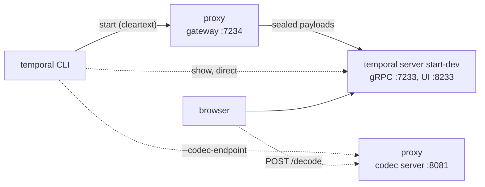

# Codec server example

The proxy seals every payload before it reaches the Temporal Service, so anything that reads history without passing
through the gateway, such as the Web UI or `temporal workflow show` pointed straight at the service, sees only
ciphertext. The codec server fixes that. It is a small HTTP service the proxy runs on its own port, answering the
standard `/encode` and `/decode` routes with the same keys the gateway uses, so those clients can open and seal payloads
without ever talking to the gateway.

This example runs the whole loop on localhost: start a Workflow through the gateway, read its sealed input straight from
the dev server, then read it in the clear through the codec server, from the CLI and from the dev server's Web UI.



## Prerequisites

- Go and a checkout of this repository; the proxy runs from source.
- The `temporal` CLI, for the dev server and for starting and inspecting Workflows.
- No cloud account and no credentials: everything in this example runs on localhost.

> [!NOTE]
>
> If `TEMPORAL_API_KEY` is set in your shell, perhaps from running the Cloud example, unset it first. With an API key
> present the CLI turns on TLS, and every command below fails with `tls: first record does not look like a TLS handshake`,
> since everything here is plaintext on localhost. The commands pass `--namespace default` explicitly, so a leftover
> `TEMPORAL_NAMESPACE` does not matter.

## Run it

Open two terminals.

Terminal 1 starts the dev server and tells its Web UI where the codec server is:

```bash
temporal server start-dev --ui-codec-endpoint http://127.0.0.1:8081
```

Terminal 2, from the repository root, starts the proxy:

```bash
go run ./cmd/proxy serve -c examples/codecserver/config.yaml
```

```text
{"level":"info","namespace":"default","uri":"testing://<redacted>","time":"2026-10-06T14:34:19-04:00","message":"Registering crypto key"}
{"level":"warn","component":"codecserver","time":"2026-10-06T14:34:19-04:00","message":"Codec server is running without authentication, which is only allowed on a loopback bind"}
{"level":"info","component":"codecserver","addr":"127.0.0.1:8081","time":"2026-10-06T14:34:19-04:00","message":"Starting the codec server"}
{"level":"info","component":"metrics","addr":":9090","time":"2026-10-06T14:34:19-04:00","message":"Starting metrics server"}
{"level":"warn","addr":"127.0.0.1:7234","time":"2026-10-06T14:34:19-04:00","message":"Running with insecure credentials. Configure TLS for production use."}
{"level":"info","addr":"127.0.0.1:7234","time":"2026-10-06T14:34:19-04:00","message":"Starting the server"}
```

These warnings are expected here. The codec server runs without authentication because it is bound to loopback, and the
`insecure credentials` line describes the plaintext gateway on this machine.

## Start a Workflow through the gateway

No Worker is needed: a Workflow that is only scheduled already carries its input in history.

```bash
temporal workflow start --address 127.0.0.1:7234 --namespace default \
  --type Greeting --task-queue codec-demo --workflow-id codec-demo --input '"Hello, Temporal!"'
```

```text
Running execution:
  WorkflowId  codec-demo
  RunId       01a0f3ac-fcdc-7553-88bd-139486be7588
  Type        Greeting
  Namespace   default
  TaskQueue   codec-demo
```

Your run ID will differ.

## Read it without the gateway

Straight to the dev server, the input is sealed (only the input lines are shown):

```bash
temporal workflow show --address 127.0.0.1:7233 --namespace default --workflow-id codec-demo --detailed | grep input
```

```text
input.payloads[0].data: n9hR8BKIw9ukXsjUCjacNOCcJzCwp2sBLLwgGaKZgOol9ghQFoXIvXmHa1UvK3OU1PTMh2a+CWlmFCZX/vPgJf1W1qL8O6rl
input.payloads[0].metadata.encoding: YmluYXJ5L2VuY3J5cHRlZA==
input.payloads[0].metadata.encryption-dek: SktMN3c3b0RneUFubENoNkxOSFg4aHNOVDhZRUFOemphUWMwWTA3YkRacEdmMjBRaEJxd3RiM0h2bTV6ZmNDOVYrYjltN1F6UTNvWldpdnVMS0FTRDhkeHVtV09GSWtq
input.payloads[0].metadata.encryption-key-id: YmFzZTY0a2V5Oi8vSFlPa0NGM3RCQk1xVGp6cWxEYVR4RWUxeDhwUWpQUFVOUTI3RlhJTi0yND0=
```

The encoding decodes to `binary/encrypted`. The key ID decodes to `base64key://` followed by the key itself, since the
proxy opens `testing://` keys with gocloud's `base64key` keeper; that is one of the reasons the scheme is for local runs
only.

Point the same command at the codec server and the CLI hands each payload to `/decode` before printing it:

```bash
temporal workflow show --address 127.0.0.1:7233 --namespace default --workflow-id codec-demo --detailed \
  --codec-endpoint http://127.0.0.1:8081 | grep input
```

```text
input[0]: Hello, Temporal!
```

## Read it in the UI

Open the Workflow at `http://localhost:8233/namespaces/default/workflows/codec-demo/<run ID>/history`, using the run ID
from the start command, or find `codec-demo` in the Workflow list at <http://localhost:8233>. The input shows as
`"Hello, Temporal!"`: the browser fetched the sealed history from the dev server and posted each payload to the codec
server's `/decode`. `127.0.0.1:8233` works too, since `config.yaml` allows both origins.

If you started the dev server without `--ui-codec-endpoint`, set `http://127.0.0.1:8081` in the UI's codec server
settings instead. That setting is stored in your browser and takes precedence over `--ui-codec-endpoint`, so if the UI
still shows sealed payloads, check for a leftover endpoint there, for example one saved while working with the Cloud UI.

## Write through the codec server

The codec server seals too. Start a second Workflow straight against the dev server, letting `/encode` seal the input:

```bash
temporal workflow start --address 127.0.0.1:7233 --namespace default --codec-endpoint http://127.0.0.1:8081 \
  --type Greeting --task-queue codec-demo --workflow-id codec-direct --input '"Sealed by the codec server"'
```

```text
Running execution:
  WorkflowId  codec-direct
  RunId       01a0f3b2-18d4-70b7-bb17-7d6e236e1881
  Type        Greeting
  Namespace   default
  TaskQueue   codec-demo
```

The gateway, with no codec flags at all, opens it:

```bash
temporal workflow show --address 127.0.0.1:7234 --namespace default --workflow-id codec-direct --detailed | grep input
```

```text
input[0]: Sealed by the codec server
```

Both paths share one set of keys, so a payload sealed on either one opens on the other.

## Beyond localhost

This configuration is only accepted because the codec server is bound to loopback. Anywhere else, the proxy requires
both `tls` and `auth` under `codecServer`, and the Web UI will not send an access token over plain HTTP. See the
[codec server section](../../README.md#codec-server) of the main README for the configuration keys and what a reachable
codec server exposes, and [the Cloud UI guide](../../docs/ui/cloud.md) for a browser-facing setup.

## Troubleshooting

When the UI cannot decode a payload it shows the sealed one instead of an error. If the input still reads as a base64
blob, check the browser console. The usual cause is an origin missing from `codecServer.cors.origins`, such as opening
the UI on a host or port the config does not list: the codec server answers the preflight without an
`Access-Control-Allow-Origin` header, so the browser never sends the request itself.

## Clean up

Stop the proxy and the dev server with Ctrl+C. The dev server keeps no state between runs by default, so both Workflows
go with it.
