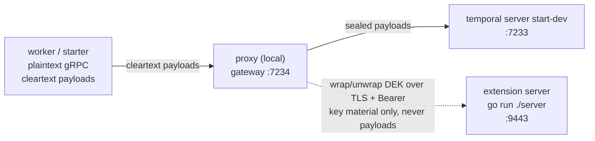

# KMS extension server example

This example encrypts every payload the proxy moves to a Temporal Service, the same envelope encryption the Cloud
example uses, but the key that wraps each data encryption key (DEK) lives in a small gRPC service you run yourself
instead of a cloud KMS. The proxy talks to that service, an extension server, only to wrap and unwrap DEKs; it never
sends payload plaintext there.



## Prerequisites

- Go and a checkout of this repository; the proxy and the example both run from source.
- The `temporal` CLI, for the dev server and for inspecting Workflow history.
- No cloud account and no credentials: everything in this example runs on localhost.

Everything under `examples` is one Go module, and its `go.mod` builds the proxy from this working tree with a `replace`
directive; if you copy this example into another tree, drop that `replace` line and require a released proxy version
instead.

## Generate certificates

```bash
cd examples/kms
go run ./gencerts
```

```text
2026/09/16 13:29:59 wrote certs/ca.pem
2026/09/16 13:29:59 wrote certs/server.pem
2026/09/16 13:29:59 wrote certs/server-key.pem
```

This writes a throwaway certificate authority and a server certificate for the extension server into `certs/`
(gitignored). The CA's private key is discarded right after it signs the server certificate, so nothing else can ever be
signed by it, and the CA is never installed in any system trust store; the proxy is pointed at the CA file directly
through `config.yaml`.

## Environment

```bash
export KMS_API_KEY=example-token
export KMS_MASTER_SECRET=example-master-secret
```

The proxy only needs `KMS_API_KEY`, the bearer token it presents to the extension server. The extension server needs
both: the same API key to authenticate callers, and the master secret every Namespace's wrapping key is derived from.

## Run

Open four terminals.

Terminal 1, in `examples/kms`, starts the dev server:

```bash
temporal server start-dev
```

Terminal 2, in `examples/kms`, starts the extension server:

```bash
KMS_API_KEY=example-token KMS_MASTER_SECRET=example-master-secret go run ./server
```

```text
{"level":"info","component":"examples","addr":"127.0.0.1:9443","time":"2026-09-16T14:19:48-04:00","message":"Starting extension server"}
```

Terminal 3, from the repository root, starts the proxy:

```bash
KMS_API_KEY=example-token go run ./cmd/proxy serve -c examples/kms/config.yaml
```

```text
{"level":"info","namespace":"default","uri":"extension://kms/payloads","time":"2026-09-16T14:20:03-04:00","message":"Registering crypto key"}
{"level":"warn","addr":"/var/folders/6m/x_q_q9nx6ns3ygnf48xzqrn80000gn/T/127-0-0-1-7233-6689a1b6.sock","time":"2026-09-16T14:20:03-04:00","message":"Running with insecure credentials. Configure TLS for production use."}
{"level":"info","addr":"/var/folders/6m/x_q_q9nx6ns3ygnf48xzqrn80000gn/T/127-0-0-1-7233-6689a1b6.sock","time":"2026-09-16T14:20:03-04:00","message":"Starting the server"}
{"level":"info","component":"metrics","addr":":9090","time":"2026-09-16T14:20:03-04:00","message":"Starting metrics server"}
{"level":"warn","addr":"127.0.0.1:7234","time":"2026-09-16T14:20:03-04:00","message":"Running with insecure credentials. Configure TLS for production use."}
{"level":"info","addr":"127.0.0.1:7234","time":"2026-09-16T14:20:03-04:00","message":"Starting the server"}
```

The two `Running with insecure credentials` warnings are expected, not a sign anything is broken: they describe the
local gateway and an internal socket, the plaintext hops between the Worker/starter and the proxy on this machine. They
say nothing about whether payloads get sealed or about the TLS connection to the extension server; both of those are
unaffected.

Terminal 4, in `examples/kms`, starts the Worker:

```bash
go run ./worker
```

```text
2026/09/16 14:20:25 worker listening on task queue "kms-example" (namespace "default")
```

With all four running, start the Workflow from `examples/kms`:

```bash
go run ./starter
```

```text
2026/09/16 14:20:55 started workflow id=kms-example-greeting runID=01a0ab73-4d2f-7d42-9a38-4e979edc599e
Hello, Temporal!
```

Your run ID and timestamps will differ.

## What just happened

The Worker and starter never saw an encryption key: they dialed the proxy at `127.0.0.1:7234` in plaintext and exchanged
the plain string `"Temporal"` and the plain string `"Hello, Temporal!"`. For the Workflow's first payload, the proxy:

1. generated a random 32-byte DEK;
2. called the extension server's `Encrypt` RPC over TLS, with a bearer token, asking it to wrap that DEK under the
   Namespace `default` - this is the only thing that crossed the wire to `127.0.0.1:9443`, no payload plaintext ever
   went there;
3. sealed the payload locally with the DEK and recorded the wrapped DEK, and the key's URI, in the payload's metadata;
   and
4. sent the sealed payload on to the dev server at `127.0.0.1:7233`.

Every later payload in the same run, the Activity's input and result and the Workflow's own result, reused the cached
DEK instead of asking the extension server to wrap a new one; see "The cache is working" below.

## See the ciphertext

> [!NOTE]
>
> If `TEMPORAL_API_KEY` is set in your shell, perhaps from running the Cloud example, the commands below fail with
> `tls: first record does not look like a TLS handshake`. The CLI turns on TLS whenever an API key is present, and
> everything here is plaintext on localhost. Unset it for this shell, or prefix each command with
> `env -u TEMPORAL_API_KEY`.

Straight to the dev server, bypassing the proxy, the payload is still sealed:

```bash
temporal workflow show --workflow-id kms-example-greeting --namespace default --address 127.0.0.1:7233
```

```text
Progress:
  ID           Time                     Type
    1  2026-09-16T18:20:55Z  WorkflowExecutionStarted
    2  2026-09-16T18:20:55Z  WorkflowTaskScheduled
    3  2026-09-16T18:20:55Z  WorkflowTaskStarted
    4  2026-09-16T18:20:55Z  WorkflowTaskCompleted
    5  2026-09-16T18:20:55Z  ActivityTaskScheduled
    6  2026-09-16T18:20:55Z  ActivityTaskStarted
    7  2026-09-16T18:20:55Z  ActivityTaskCompleted
    8  2026-09-16T18:20:55Z  WorkflowTaskScheduled
    9  2026-09-16T18:20:55Z  WorkflowTaskStarted
   10  2026-09-16T18:20:55Z  WorkflowTaskCompleted
   11  2026-09-16T18:20:55Z  WorkflowExecutionCompleted

Results:
  Status          COMPLETED
  Result          {"metadata":{"encoding":"YmluYXJ5L2VuY3J5cHRlZA==","encryption-dek":"Q2pBYk1EL1hnOVhvdzhJVHAyWW05OGF4TFpsZ0NLVWM5dzhqR1JNZGIzRHNuRmRQZzJCN2RHUWU0d0J5cmZzWjkxRVNBVEVhQjJSbFptRjFiSFFxREI3SXpUK2czVCs2eC9GTTZUQUI=","encryption-key-id":"ZXh0ZW5zaW9uOi8va21zL3BheWxvYWRz"},"data":"WdRwTsSWKWsoyldRQfistoaT5DsuIuF9uftGk8/TcIBAj/WPsljEBLEmuWhIN/hkTDnsVSVqB3wU0V4IQnt+NqH2smj1cIBj"}
  ResultEncoding  binary/encrypted
```

Through the proxy, the same execution comes back in the clear (only the `Results` block is shown below):

```bash
temporal workflow show --workflow-id kms-example-greeting --namespace default --address 127.0.0.1:7234
```

```text
Results:
  Status          COMPLETED
  Result          "Hello, Temporal!"
  ResultEncoding  json/plain
```

The Web UI at <http://localhost:8233> shows the same completed execution directly against the dev server, so it is
another way to browse the sealed history without running the CLI twice.

## The cache is working

Across the whole run above, the extension server's log shows a single wrap and a single unwrap:

```text
{"level":"info","component":"examples","time":"2026-09-16T14:20:55-04:00","message":"Wrapped a DEK"}
{"level":"info","component":"examples","time":"2026-09-16T14:20:55-04:00","message":"Unwrapped DEK"}
```

The one wrap is the number to watch, and it is the same on every run. The unwrap count is not: this run needed one, and
reading the whole history back through the proxy afterwards added none, since that DEK was already cached. Expect a few
on a busier run. The read-side cache is filled after the first miss and has no single-flight, so payloads opened
concurrently can all miss it together and each ask the extension server for the same DEK.

Meanwhile the Workflow's history carries four payloads sealed under that one DEK: the Workflow input, the Activity's
input and result, and the Workflow's result each carry an `encryption-dek` entry in their metadata. Three separate
settings are behind that, and they govern different sides of the exchange. `duration: 1h` is how long the proxy reuses
one sealed-side DEK before wrapping a fresh one, which is why sealing four payloads in this run only cost one wrap call.
`renewBefore: 15m` is how far ahead of `duration`'s expiry the proxy starts rotating in a replacement sealed-side DEK.
`cacheSize` is unrelated to sealing: it bounds a separate LRU of unwrapped DEKs the proxy keeps for reading history
back, keyed by the encrypted DEK it already opened once, and `config.yaml` leaves it commented out to take the default
of 100.

## How the provider works

The whole provider is the `server` command you ran in terminal 2, and it is one method. `server/keyring.go` derives
keys, and that is all it does; it contains no cryptography beyond the derivation itself. Everything around it comes from
`pkg/ext`: `ext.NewKeyWrapper` turns that method into an `ext.KMS`, and `ext.Serve` registers it, checks the bearer
token, serves TLS, and shuts down on a signal. Start with `keyring.go` if you are writing one of these against a real
key service, because that method is the part you replace:

```go
func (k *keyring) Key(_ context.Context, req ext.KeyRequest) (ext.Key, error)
```

The request is a struct rather than bare arguments so that a later release can ask for more without breaking lookups
already written against it, and the same goes for the answer.

What is worth understanding before writing your own is that a version is an answer as much as a question. An empty
`req.Version` asks for whichever key is current, and the reply says which one that turned out to be; a version that is
set names one exactly. A version belongs to a key rather than to the server holding it, so a key service that rotates on
its own schedule just starts reporting a new version, and new material follows it without this server being
reconfigured or redeployed. This provider has no key service to ask, so it answers with the `currentVersion` constant,
which is the one place it is pretending.

`Decrypt` is handed nothing but the ciphertext `Encrypt` returned, no Namespace and no other context, so anything needed
to find the wrapping key again has to travel inside it. The key wrapper handles that by framing what it seals as
`KeyMaterial` (`api/ext/v1/key_material.proto`, Go package `pkg/api/ext/v1`) and unmarshalling it on the way back:

| Field           | What the key wrapper puts in it                                                        |
| --------------- | -------------------------------------------------------------------------------------- |
| `encrypted_dek` | the DEK sealed with AES-256-GCM: 48 bytes, 32 of DEK plus a 16-byte tag                |
| `version`       | the version `Key` reported when sealing; it comes back as `req.Version` when opening   |
| `namespace`     | the local Namespace, which arrives as `req.Namespace` both ways                        |
| `nonce`         | the 12 random bytes this seal used, in the clear as a nonce must be                    |
| `cipher`        | `CIPHER_AES_256_GCM`, so material sealed before a cipher change still opens afterwards |
| `opaque`        | nothing, because it belongs to the server and the key wrapper does not take it         |

Only `encrypted_dek` is required. A server that frames its own material can set as few of the rest as it likes, and
`opaque` is the field to reach for when a key service needs something the others cannot express: the proxy round-trips
it untouched and gives it no meaning, so whatever goes in owns its own compatibility.

Three properties fall out of that table. Every field above that travels in the clear is also the AEAD's additional data,
so key material relabelled with a different Namespace, version, or cipher fails to open rather than silently decrypting
under the wrong key. Version and Namespace together address one key, so bumping `currentVersion` seals new payloads
under a new key while everything already sealed still opens, since each payload carries the version that derives its own
key. And because the cipher travels too, `ext.WithCipher` can move new material to ChaCha20-Poly1305 or
XChaCha20-Poly1305 without stranding anything sealed under the old one.

All of this is framing, not encryption, and you can read it. The `encryption-dek` value in the history above is base64
twice over, once by the CLI and once by the proxy's own payload metadata:

```bash
echo 'Q2pBYk1EL1hnOVhvdzhJVHAyWW05OGF4TFpsZ0NLVWM5dzhqR1JNZGIzRHNuRmRQZzJCN2RHUWU0d0J5cmZzWjkxRVNBVEVhQjJSbFptRjFiSFFxREI3SXpUK2czVCs2eC9GTTZUQUI=' |
  base64 -d | base64 -d | xxd
```

```text
00000000: 0a30 1b30 3fd7 83d5 e8c3 c213 a766 26f7  .0.0?........f&.
00000010: c6b1 2d99 6008 a51c f70f 2319 131d 6f70  ..-.`.....#...op
00000020: ec9c 574f 8360 7b74 641e e300 72ad fb19  ..WO.`{td...r...
00000030: f751 1201 311a 0764 6566 6175 6c74 2a0c  .Q..1..default*.
00000040: 1ec8 cd3f a0dd 3fba c7f1 4ce9 3001       ...?..?...L.0.
```

The version and the Namespace are legible in the right-hand column, and the trailing `3001` is the cipher. That is also
why this key material is 78 bytes while the `payments` Namespace's, in the optional section below, is 79: the only
difference is one more byte of Namespace name. Every byte of it rides in the metadata of each payload it seals, and
stays there for as long as the Workflow retention period, so it should carry what decrypt needs to find the key and
nothing else.

Three things worth being honest about. First, a Namespace is not secret, but a real provider that would rather not carry
a plaintext tenant name in its ciphertexts would implement `ext.KMS` itself rather than use the key wrapper, and put an
opaque key identifier in `opaque` instead. Second, the `payloads` segment in `config.yaml`'s key URI
(`extension://kms/payloads`) never reaches the extension server; the provider selects a key by Namespace alone, nothing
else. That segment exists only on the proxy's side, as the identifier it uses to pick the same key policy again when
opening a payload later, but it does have to be globally unique across `default` and every entry in `overrides`: two
policies sharing a URI fail proxy startup with a `duplicate key id` error (see the optional section below). Third, the
Namespace the provider receives is always the local, pre-translation Namespace, never a translated remote name; this
example configures no translation so it never comes up here, but a provider paired with Namespace translation has to key
on that same local name, or its per-Namespace keys end up misaligned with the Namespace a caller actually asked for.

## When it breaks

**Wrong credentials.** Restarting the extension server with a different `KMS_API_KEY` while the proxy still holds the
old one does not fail right away: the proxy caches DEKs, so a run within the cache window keeps succeeding without
another call to the extension server. Left alone, that window closes on its own after roughly 45 minutes (the `1h`
`duration` minus the `15m` `renewBefore` head start), when the proxy wraps a fresh DEK and finally calls an extension
server that no longer accepts the old credential; a broken credential can stay invisible for most of an hour. To see the
failure immediately instead of waiting, restart the proxy, which clears the cache and forces a fresh `Encrypt` call,
which the extension server now rejects:

```text
start workflow: rpc error: code = Unauthenticated desc = failed to encrypt payload: failed to encrypt message in
namespace: default, failed to encrypt DEK, id: extension://kms/payloads, err: rpc error: code = Unauthenticated
desc = invalid credentials
```

The Workflow never starts; no execution shows up in `temporal workflow list`. The error surfaces only on the starter's
side. The proxy's own log stays silent about it.

**Wrong certificate name.** Removing `serverName: localhost` from `config.yaml`'s extension server block does not stop
the proxy from starting: nothing dials the extension server until the first payload needs a key, so a mismatched server
name is invisible at boot. The first Workflow start after that just hangs and times out, rather than failing with a
clear error:

```text
start workflow: context deadline exceeded
```

Again the proxy's log has nothing to say, and no execution is created either. The real problem only surfaces if you turn
on gRPC's own logging (`GRPC_GO_LOG_SEVERITY_LEVEL=info GRPC_GO_LOG_VERBOSITY_LEVEL=2`), where the proxy retries every
couple of seconds with:

```text
x509: cannot validate certificate for 127.0.0.1 because it doesn't contain any IP SANs
```

which is exactly the mismatch the comment above `serverName` in `config.yaml` describes: the certificate carries
`DNS:localhost` and no IP address, so verifying the dialed `127.0.0.1` fails without that setting. Put the line back and
restart the proxy to recover.

## What this is not

This provider is a teaching aid, not a key manager:

- the master secret lives in a plain environment variable (`KMS_MASTER_SECRET`);
- that secret also has to be actual secret material: HKDF extracts entropy from it rather than adding any, so it needs
  to be at least 32 bytes of cryptographic randomness, for example from `openssl rand -base64 32`, not a human-chosen
  passphrase. A passphrase here is directly brute-forceable, and recovering it yields every per-Namespace key at once.
  This example's own value, `example-master-secret`, is a passphrase, and that is fine only because this is a localhost
  demo, not something to copy into a real deployment;
- nothing rotates on its own: `currentVersion` is a constant, so the same secret derives the same per-Namespace key
  until someone edits it. The version in the key material is what makes a real rotation survivable, since payloads
  sealed under an earlier version keep opening; and
- losing that secret loses every payload ever sealed under it, with no recovery path.

Also worth flagging: the extension server here authenticates only with a bearer token over TLS, which is the right
choice for this example and matches what the proxy sends. `config.yaml`'s `tls` block for an extension server also
accepts `cert` and `key`, so a real extension server would likely add mutual TLS, requiring a client certificate
alongside the token.

For a real deployment, point the proxy's `encryption` block at one of the built-in schemes instead: `awskms://`,
`azurekeyvault://`, or `gcpkms://`.

## Running it again

The starter always uses the fixed Workflow ID `kms-example-greeting`. Run it again after the previous run has completed
and nothing special happens: the server's default Workflow ID reuse policy allows a new run once the old one has closed,
so you get a fresh run ID and `Hello, Temporal!` again with no cleanup required.

The case worth knowing about is a still-open execution, for example one started while the Worker was stopped. Here
neither the SDK nor the CLI report an already-started error the way you might expect: `ExecuteWorkflow` and
`temporal workflow start` both attach to the open run instead of rejecting the request, so the starter just blocks
waiting for a result that will not arrive until a Worker picks the run up. If that happens, either bring the Worker back
so the open run can finish, clear it directly with:

```bash
temporal workflow terminate --workflow-id kms-example-greeting --namespace default --address 127.0.0.1:7234
```

or restart the dev server, whose state lives entirely in memory.

## Optional: per-Namespace keys

Restarting the dev server below discards the `kms-example-greeting` execution from the sections above, since its state
lives entirely in memory; that is fine for this section, which stands on its own, but do it only once you are done
inspecting that execution.

Start the dev server with a second Namespace:

```bash
temporal server start-dev -n payments
```

This pre-creates both `default` and `payments` on the same server. Add an override to `config.yaml` so the proxy uses a
distinct key for `payments`:

```yaml
encryption:
  enabled: true
  default:
    uri: extension://kms/payloads
    duration: 1h
    renewBefore: 15m
  overrides:
    payments:
      uri: extension://kms/payments-payloads
      duration: 1h
      renewBefore: 15m
```

The override's URI has to differ from the default key's URI even though both point at the same extension server: as
noted above, reusing `extension://kms/payloads` for both fails proxy startup with
`duplicate key id: extension://kms/payloads`. Restart the proxy, then start a Workflow against the new Namespace; no
Worker is needed for this check, since the key exchange happens on the way in:

```bash
temporal workflow start --address 127.0.0.1:7234 --namespace payments --task-queue kms-example \
  --type GreetingWorkflow --workflow-id kms-payments-demo --input '"Payments"'
```

The extension server's log shows a second wrap, appended below the pair from the earlier run in "The cache is working"
above:

```text
{"level":"info","component":"examples","time":"2026-09-16T14:21:49-04:00","message":"Wrapped a DEK"}
```

The log alone cannot tell you those two wraps used different keys, since it says nothing about which Namespace asked.
The key material can:

```bash
temporal workflow show --workflow-id kms-payments-demo --namespace payments --address 127.0.0.1:7233 -o json |
  grep -o '"encryption-dek": *"[^"]*"' | head -1 | sed 's/.*: *"\(.*\)"/\1/' | base64 -d | base64 -d | xxd
```

```text
00000000: 0a30 ceac 1c85 d8de e89b a41f 81ab 3f4d  .0............?M
00000010: ac73 9684 febe 9866 5518 7e4e 57b2 a235  .s.....fU.~NW..5
00000020: 61c0 51dd 194c ba04 6aaf 81d7 261a 6a7c  a.Q..L..j...&.j|
00000030: d1b2 1201 311a 0870 6179 6d65 6e74 732a  ....1..payments*
00000040: 0c29 a180 a18e 4551 9a8f 737d e730 01    .)....EQ..s}.0.
```

The `namespace` field reads `payments` rather than `default`, one byte longer, and that is what selects the derived key.
Same master secret, same extension server connection, but a different key per Namespace. Clean up with:

```bash
temporal workflow terminate --workflow-id kms-payments-demo --namespace payments --address 127.0.0.1:7234
```
