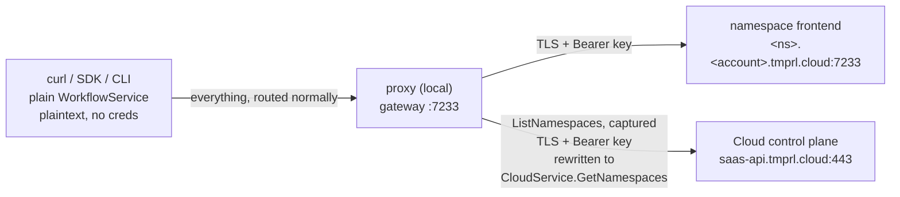

# ListNamespaces on Temporal Cloud

`WorkflowService.ListNamespaces` cannot be called on Temporal Cloud. This example makes it work through the proxy, with
no change to the caller: you `curl` the proxy with a plain WorkflowService request and get a plain WorkflowService
response back.



## Why it needs a proxy at all

Cloud pins each request's namespace to the endpoint hostname and rejects any request whose body namespace differs.
`ListNamespacesRequest` has no namespace field, so its body namespace is always empty and the check can never pass — on
any Cloud endpoint. Cloud exposes the same capability as `CloudService.GetNamespaces` on a different host instead, which
speaks a different service with different message types.

So forwarding the call is not enough; it has to be **translated**. Routing is not involved and there is no rule for
`ListNamespaces`: the proxy captures it on its way to whichever upstream routing chose, rewrites it to
`CloudService.GetNamespaces`, sends it to the Cloud API instead, and converts the reply back into a
`ListNamespacesResponse`.

Nothing in `config.yaml` asks for this. A `.tmprl.cloud` address is recognised as Temporal Cloud, and translating what
Cloud cannot serve follows from that — the same detection that turns on Cloud namespace validation. Where `CloudService`
lives is a fixed fact about Temporal Cloud rather than a policy an operator picks, so the destination travels with the
translation instead of having to be restated as configuration.

The control plane is reached at `saas-api.tmprl.cloud:443` with the upstream's own API key, which authorises both. An
optional `cloudApi:` block overrides that for a different Cloud environment.

Everything else — including `GetSystemInfo`, which every SDK calls on connect — keeps going to the namespace frontend
untouched.

## Prerequisites

- A Temporal Cloud namespace. Note its fully-qualified name, shown in the Cloud UI as `<namespace>.<account>` (for
  example `quickstart.a1b2c`); you split it across two environment variables below.
- An API key with permission to read namespaces, and API key authentication enabled on the namespace. See
  [API keys](https://docs.temporal.io/cloud/api-keys).
- Go, and a checkout of this repository (the proxy runs from source).
- [`buf`](https://buf.build/docs/installation) for `buf curl`. It comes with `mise install` in this repo.

## Configure

```bash
export TEMPORAL_NAMESPACE=quickstart
export TEMPORAL_ACCOUNT=a1b2c
export TEMPORAL_API_KEY=<your-api-key>
```

## Run the proxy

From the repository root:

```bash
go run ./cmd/proxy serve -c examples/listnamespace/config.yaml
```

The first log line confirms the translation is armed:

```json
{"level":"info","hostPort":"saas-api.tmprl.cloud:443",
 "methods":"/temporal.api.workflowservice.v1.WorkflowService/ListNamespaces",
 "message":"translating methods to the Cloud API"}
```

You will also see `Running with insecure credentials` a couple of times. That is expected: it refers to the unix sockets
the proxy uses internally between its own tiers, which never leave the machine. Both hops to Cloud are TLS.

## Test it

The gateway is plaintext gRPC on `127.0.0.1:7233`, so `buf curl` needs no certificates. Leave the proxy running and use
a second terminal.

### The one that only works through the proxy

```bash
buf curl --protocol grpc --http2-prior-knowledge \
  --schema buf.build/temporalio/api \
  -d '{}' \
  http://127.0.0.1:7233/temporal.api.workflowservice.v1.WorkflowService/ListNamespaces
```

You should get every namespace in the account:

```json
{
  "namespaces": [
    {
      "namespaceInfo": {
        "name": "quickstart.a1b2c",
        "state": "NAMESPACE_STATE_REGISTERED"
      },
      "config": {
        "workflowExecutionRetentionTtl": "2592000s"
      }
    }
  ]
}
```

Those fields were built from a `CloudService.GetNamespaces` reply. Cloud has no equivalent for a namespace UUID, owner
email, or Temporal cluster names, so `namespaceInfo.id`, `ownerEmail`, and `replicationConfig` are left unset rather
than filled with something invented.

Point the same request straight at Cloud to see what the proxy is saving you from:

```bash
buf curl --protocol grpc \
  --schema buf.build/temporalio/api \
  -H "Authorization: Bearer $TEMPORAL_API_KEY" \
  -d '{}' \
  "https://$TEMPORAL_NAMESPACE.$TEMPORAL_ACCOUNT.tmprl.cloud:7233/temporal.api.workflowservice.v1.WorkflowService/ListNamespaces"
```

```text
InvalidArgument: namespace mismatch between header "quickstart" and request body ""
```

### Paging

The page token round-trips, so paging works normally. Ask for one namespace at a time:

```bash
buf curl --protocol grpc --http2-prior-knowledge \
  --schema buf.build/temporalio/api \
  -d '{"pageSize": 1}' \
  http://127.0.0.1:7233/temporal.api.workflowservice.v1.WorkflowService/ListNamespaces
```

Feed the `nextPageToken` from the response back in as `{"pageSize": 1, "nextPageToken": "<token>"}` to get the next one.

### Everything else is unaffected

`GetSystemInfo` is also namespace-less and travels the same connection the translation is installed on, so only the
translation registry distinguishes the two. It still goes to the frontend. If this breaks, no SDK can connect through
the proxy — it is the call every client makes first:

```bash
buf curl --protocol grpc --http2-prior-knowledge \
  --schema buf.build/temporalio/api \
  -d '{}' \
  http://127.0.0.1:7233/temporal.api.workflowservice.v1.WorkflowService/GetSystemInfo
```

And ordinary namespaced traffic is untouched. Note the fully-qualified name — this config does no namespace rewriting:

```bash
buf curl --protocol grpc --http2-prior-knowledge \
  --schema buf.build/temporalio/api \
  -d "{\"namespace\": \"$TEMPORAL_NAMESPACE.$TEMPORAL_ACCOUNT\"}" \
  http://127.0.0.1:7233/temporal.api.workflowservice.v1.WorkflowService/DescribeNamespace
```

## Optional: short namespace names

Uncomment the `namespaces.rules` block on the `frontend` upstream in `config.yaml` and restart. The names in the
`ListNamespaces` reply come back as `quickstart` rather than `quickstart.a1b2c`.

This composes rather than being a special case: namespace translation runs *outside* method translation, so by the time
it sees the message it is an ordinary `ListNamespacesResponse` and every namespace name in it gets rewritten the same
way as in any other reply.

## Troubleshooting

| Symptom | Cause |
| --- | --- |
| `InvalidArgument: cloud API version must be specified` | The proxy stamps `temporal-cloud-api-version` itself; seeing this means the request reached saas-api without going through the translation. |
| `Unimplemented: method ListNamespaces not implemented` | The request went to the frontend untranslated — the upstream was not recognised as Cloud. Set `cloud: true` on it if its address carries no Cloud domain (private link). |
| `PermissionDenied` on `ListNamespaces` only | The API key needs account-level read access; namespace-scoped keys cannot list. |
| Empty `namespaces` list, no error | The key is valid but scoped to nothing readable. |
