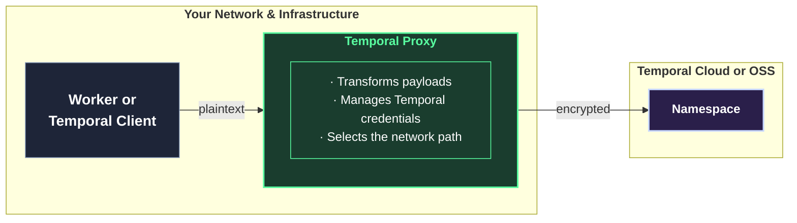
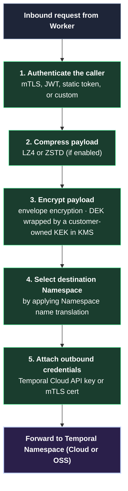

# Request for Comment: Temporal Proxy

This Request For Comment ("RFC") from Temporal asks for feedback from Temporal users on a piece of infrastructure we’re building to help platform teams manage security and networking.

Please send comments—big and small—to proxy@temporal.io or your Temporal account rep. Your input helps us approach these problems in a way that works for your organization.

We greatly appreciate your time and perspective. Thank you in advance!

## What is Temporal Proxy?

An open source, Temporal-supported proxy that sits between Temporal Workers and a Temporal cluster (OSS or Temporal Cloud), handling payload encryption, compression, authentication, and Namespace routing on their behalf.

### 30,000 ft view of Temporal Proxy

⚠️ This document is a proposal, not a commitment. The implementation of Temporal Proxy may be different than described here, depending on the feedback from this RFC.

## Who this RFC is tailored for

Platform engineers, architects, and operators who offer Temporal as-a-service to many developer teams (although anyone using Temporal can use Temporal Proxy).

## Why build a proxy?

For a modern organization to use Temporal in the critical path, they must follow security and networking best practices. But as more developers build on Temporal, these practices become harder to implement and enforce.

Temporal Proxy aims to be an efficient, scalable way to implement security and networking best practices with Temporal.

### The jobs to be done

To use Temporal in production—especially if using Temporal Cloud—most organizations must:

1. **Transform Workflow data** (a.k.a. the “payload”) before it is sent to the Namespace. For example, they must **encrypt** the payload for security and data privacy.
2. **Manage Namespace authentication credentials**. For example, Workers using Temporal Cloud must authenticate with either an API Key or an mTLS Certificate, which must be rotated regularly.
3. **Navigate a specific network path**. Some business goals require a complex networking setup, such as a DMZ, PrivateLink, or custom endpoint.

### Today’s method

In Temporal out-of-the-box, the payload transformation, authentication, and network path are **managed within each Worker or Temporal client**, often relying on systems like a codec server, KMS, or service discovery. That approach:

- **Takes time from each developer** to adopt in their own code, which grows in proportion to the number of developers using Temporal.
- **Leaves room for misconfiguration** and time spent debugging incorrect configurations.
- **Cannot be enforced and audited** by the platform team to discover mistakes (e.g., if a Worker forgot to add the encryption codec server and sent unencrypted data).

### How a proxy helps

A proxy between Workers and Namespace(s) **enables platform operators to manage these concerns**—payload transformations, authentication, and routing—rather than the individual Workers. This offers:

- **Platform enforcement of security and networking practices,** since the platform operator configures Temporal Proxy, and all Workers & Temporal clients access the Namespace through it.
- **Faster time for developers to adopt security and networking practices**, since they simply point their Workers / Temporal clients at the proxy. No extra configurations are needed in Workflow code.

Many Temporal Cloud customers have written their own proxy implementations for exactly these reasons, and are happy with this architecture. Temporal Proxy makes this approach a best practice for organizations that build on Temporal.

## Target Use Cases for Temporal Proxy 1.0

Temporal Proxy 1.0 targets several use cases:

1. **Adding encryption, compression, and authentication to new-to-Temporal workloads** — a scalable way to add payload encryption, payload compression, authentication (e.g., Temporal Cloud API Keys or mTLS certificates), and Namespace routing to vanilla Worker instances.
2. **Multi-tenancy** — one proxy fronting many Namespaces, or several proxies fronting different subsets, with most security and networking settings configurable per Namespace.
3. **Migrating from OSS Temporal to Temporal Cloud —** easing the transition from a self-hosted cluster to a Temporal Cloud Namespace, with minimal changes to Worker configurations and no changes to Workflow code.

These use cases will be covered in detail in a forthcoming RFC. To request access, email proxy@temporal.io or contact your Temporal account team.

---

## List of Capabilities: What's in 1.0 of Temporal Proxy

The features planned for the 1.0 release of Temporal Proxy. Each is independently configurable, so most deployments will only use a subset.

⚠️ This list is subject to change.

### Inbound authentication

How the proxy authenticates the Workers and clients that connect to it.

- **mTLS** at the transport layer, validated against a configured CA chain.
- **Static token** — a bearer token compared against a value in the proxy's config. Useful for simple deployments.
- **JWKS / OIDC** — JWTs validated against a JWKS URL and audience. Suitable when you already operate an OIDC identity provider.
- **Endpoint Authenticator** — the proxy delegates the decision to a gRPC service that you implement and operate. The proxy passes each request's metadata, Namespace, service, and method; your service returns allow or deny. For auth that doesn't fit any of the above, without building a custom proxy binary.

### Payload encryption

The proxy can encrypt every Workflow payload on the way upstream and decrypt it on the way back, transparent to Workers and clients — no SDK configuration, no custom Data Converter, no Codec Server registration. Encryption is configured globally, applying to the whole proxy instance and every Namespace it serves.

Temporal Proxy comes with a built-in encryption method, but this can be swapped out for custom encryption code.

#### How Temporal Proxy’s built-in envelope encryption works

- **Key Encryption Keys (KEKs)** are user-owned and live in your KMS. The proxy never holds plaintext key material.
- **Data Encryption Keys (DEKs)** are short-lived, generated and cached by the proxy, and used to encrypt the actual payload bytes. Each DEK is wrapped by the Namespace's KEK and stored in the payload metadata alongside the ciphertext.
- A single Namespace can be mapped to multiple KEKs, so you can roll forward to new key material without losing access to payloads encrypted under the previous KEK.

#### Where keys live

Keys are addressed by URI per Namespace:

- **AWS KMS** — `awskms://...`
- **Azure Key Vault** — `azurekeyvault://...`
- **GCP KMS** — `gcpkms://...`
- **Static-key mode** for development and testing — `testing://...`
- **External KMS Server** — a gRPC interface (`KMSService.Encrypt` / `Decrypt`) with a custom implementation provided by the user. The path for air-gapped environments, on-premises HSMs, or routing logic the built-in backends can't express (e.g., per-tenant accounts with separate credentials).

> **To learn more about Encryption:** See the Encryption RFC in the `rfc` folder; implementation in progress in `pkg/crypto`.

### Payload compression

Optional payload compression, applied before encryption (since encrypted bytes don't compress).

- **Algorithms:** LZ4 (prioritizes throughput) and ZSTD (prioritizes compression ratio).
- The algorithm used for each payload is recorded in the payload metadata, so the proxy can decompress correctly on the return trip even if the global setting changes mid-flight.
- Compression is configured globally, that is, it applies to the whole proxy instance and every Namespace it serves.

### Connection to Temporal Cloud

Every proxy needs to know how to reach its upstream Temporal cluster.

- **Upstream endpoint.** A Namespace Endpoint, Regional Endpoint, or VPC (PrivateLink) Endpoint. Can be pinned globally, or selected per inbound Namespace so a single proxy can route to many endpoints.
- **Transport security.** The proxy validates Temporal Cloud's TLS certificate against your configured trust chain.
- **Outbound credentials.** A Temporal Cloud API key or mTLS certificate attached to every upstream call. Pinned globally, mapped per Namespace, or resolved dynamically via a CredentialProvider interface.

### Namespace name translation

The proxy can rewrite Namespace names between what your Workers and clients use locally and what the upstream cluster expects. Four translation primitives are available and can be combined:

- A **prefix** added to every outbound Namespace name. Common for tenant isolation, e.g., `default` → `team-a.default`.
- A **suffix** added to every outbound Namespace name. The canonical case is appending a Temporal Cloud account ID, e.g., `default` → `default.a8x72`.
- **Exact-match overrides** for individual Namespaces.
- **Inclusion or exclusion lists** that constrain which Namespaces the rules apply to.

Rewriting happens before the request is sent upstream and is reversed on the response, so Workers continue to use their original Namespace names with no SDK changes.

### Request path within the Proxy

*Responses traverse the inverse path: decrypt, decompress, and return the result to the caller.*

### Codec Server for the Temporal UI

The proxy implements the Codec Server HTTP endpoints that the Temporal UI calls to decode payloads for display, so you don't need to stand up a separate Codec Server.

- **Point any UI at the proxy.** Whether the UI is self-hosted in your network or the Temporal Cloud UI, set its Codec Server setting to the proxy and payloads decode through the same interceptor chain that handles Worker calls.
- **CORS** headers and **JWT validation** (via OIDC/JWKS) are configurable for browser-originated requests.

### Deployment model

The proxy is a stateless Go binary. Two deployment shapes are supported in 1.0:

- **Shared service.** A Helm chart deploys the proxy as a horizontally-scaled service behind a headless Kubernetes service for client-side gRPC load balancing. Includes autoscaling, pod disruption budgets, and Prometheus monitors. This is the shape most organizations will use.
- **Sidecar.** Run a proxy instance in the same pod as each Worker. Simpler configuration (each sidecar only needs to know about its Worker's Namespaces) at the cost of more redeploys when configuration changes globally.

### Operations and observability

- **Prometheus metrics** covering gRPC traffic, authentication, encryption operations, KMS calls, DEK cache hit / miss, compression, and Codec Server requests.
- **Performance targets (TBD):** success rate, p50 and p99 added latency will meet reasonable goals, as measured in Temporal’s test environment.
- **Reference materials** ship alongside the proxy: Grafana dashboards, sample ingress and gateway configurations, runbooks for common failure modes, and Terraform examples for provisioning KMS keys safely (including `prevent_destroy = true` to guard against accidental KEK deletion).

## What's not in 1.0

We're explicitly deferring the following. Tell us if any of these are blockers:

- Custom IDP integrations beyond what the Endpoint Authenticator covers.
- OSS-to-Cloud or Cloud-to-OSS migrations (these must continue to use `s2s-proxy`).
- Routing Nexus calls across clusters.
- Rate limiting, throttling, or circuit breakers.
- Pluggable KMS providers beyond AWS, Azure, and GCP.

## Operational implications worth thinking about

A few things that may not be obvious:

- **The proxy is on the critical path.** If it's down, your Workers can't reach Temporal. We're designing for high availability (stateless, horizontally scaled, pod disruption budget, headless service for client-side load balancing). We highly recommend one of the following deployment models:
    - The “sidecar” deployment model for Temporal Proxy, giving each Worker its own proxy instance. (Most popular among Temporal users who have built their own proxy)
    - Horizontally scaling by running multiple proxy instances and load balancing traffic between them. Since Temporal Proxy is stateless, Workers can switch between proxy instances seamlessly.
- **Deleting a KEK from your KMS is unrecoverable.** Any payload encrypted with a DEK wrapped by that KEK is lost forever. We will document this loudly and recommend Terraform with `prevent_destroy = true`, but it's worth knowing up front.

## Potential future capabilities

The capabilities below are out of scope for 1.0 but are being tracked for possible inclusion in a future release. If any of them would meaningfully change your decision to adopt the proxy, please flag it in your feedback.

- **Oversized payload offload to external storage.** The proxy could upload large payloads (>2 MB) to a cloud blob store (S3, Azure Blob, or GCS) and replace the inline payload with a reference. The reference would be resolved and the payload reassembled transparently on the return trip. Configuration would be available globally or per Namespace.
- **HTTP Interface to Temporal.** The proxy could expose an HTTP / JSON interface for starting Workflows, signaling, querying, and other common Temporal operations — letting clients in environments without a gRPC SDK interact with Temporal.
- **Serving a Temporal Web UI directly from the Proxy.** This would make it easy to run a Temporal UI within your own network, for security reasons. Currently, the Web UI must be deployed separately, and use Temporal Proxy as a codec server.
- **Replication between Temporal clusters.** Currently, the S2S Proxy must be used to replicate data between clusters, e.g., from an OSS Temporal cluster to Temporal Cloud for a migration. This functionality could be merged into Temporal Proxy.
- **Hybrid Cloud architectures.** Enabling seamless switch between Temporal in the cloud and on-prem.
