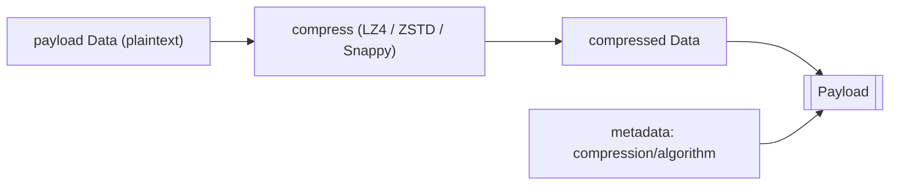
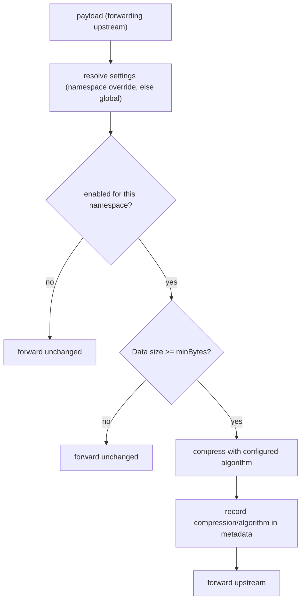
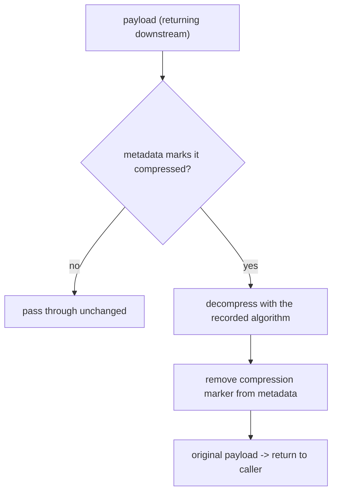

# Compression of Workflow Data

This RFC outlines a proposal for how the Temporal Proxy will optionally compress customer data before forwarding it
upstream. It expands on the **Payload compression** capability introduced in the
[Temporal Proxy overview RFC](./01-overview.md).

Questions and feedback can be directed to your Temporal account rep, the proxy team, or the community Slack channel.

- **Slack:** [#proxy](https://temporalio.slack.com/archives/C0BD5MZF6UD)
- **Email:** <proxy@temporal.io>

## Background

Workflow payloads cost bandwidth on the way to the upstream cluster and storage once they land in Workflow history,
visibility, and archival. Large, text-heavy payloads (JSON, XML, logs, serialized documents) are often highly
compressible, so compressing them before they leave the Worker pool can meaningfully cut both costs.

Today, a customer who wants this must build compression into every Worker's Data Converter or stand up their own codec
server, then keep that consistent across many teams. By centralizing compression at the proxy, operators turn it on in
one place, transparently to workflow developers, and pair it cleanly with the proxy's encryption if enabled.

Compression is designed as an **opt-in** feature. It is useful on its own and composes with encryption when both are
enabled.

> [!TIP]
>
> **Staying under Temporal's [size limits](https://docs.temporal.io/cloud/limits).** Temporal Cloud caps each payload at
> 2 MB, and every gRPC request at 4 MB across all payloads plus command metadata, so a Workflow can exceed the request
> limit even when each individual payload is under 2 MB. Because the proxy compresses before forwarding upstream, the
> cluster sees the compressed bytes, so compression can bring a payload, or a request carrying many of them, back under
> these limits.

## Goals and non-goals

Goals for the initial release:

- **Transparent:** no special Worker or client configuration; nothing changes for workflow developers.
- **Effective:** meaningful size reduction on compressible payloads, with a choice of algorithms to trade speed against
  ratio.
- **Composable:** works cleanly alongside encryption, always compressing before encrypting.
- **Reliable under change:** the proxy must never produce something it cannot later decompress. Changing the configured
  algorithm, or turning compression off, must never strand data already on the wire.
- **Observable:** operators can see whether compression is actually helping for their traffic.

Non-goals for the initial release:

- **Automatic content-type detection or auto-skip** of already-compressed or incompressible data. Operators use the
  ratio metric and per-namespace configuration instead.
- **Per-payload algorithm selection.** The configured algorithm applies to all eligible payloads.

## At a glance

- **Scheme:** per-payload. The proxy compresses the payload's `Data` and records the algorithm in the payload's
  `Metadata` so it can be decompressed correctly on the return trip.
- **Algorithms:** LZ4 (throughput), ZSTD (ratio, tunable level), and Snappy (fast, simple). All ship in every build.
- **Ordering:** compression runs before encryption, because encrypted bytes generally do not compress.
- **Granularity:** a global setting, plus optional per-namespace overrides.
- **Default algorithm:** none. When compression is enabled, an algorithm must be chosen explicitly.
- **Minimum size:** payloads below a configurable threshold are forwarded uncompressed, since the framing overhead
  outweighs any savings.
- **Decompression:** always attempted on any payload whose metadata marks it compressed, regardless of whether
  compression is currently enabled.

> [!NOTE]
>
> Decoding is driven entirely by the payload, not the current configuration. Because every build understands all
> supported algorithms, changing the configured algorithm or disabling compression never prevents an older payload from
> being decompressed.

## How it works

Compression is implemented as an interceptor that walks the request/response objects and acts on [Payload] values,
similar to how encryption works. When enabled, the proxy compresses eligible payloads before forwarding them upstream
and decompresses them before returning results downstream. All of this is transparent; Workers and clients need no
special configuration.

A compressed payload has its `Data` field set to the compressed bytes of the original data, and its `Metadata` extended
with a marker recording which algorithm was used. The payload's existing encoding metadata is preserved untouched, so
the original value is fully reconstructed on the way back.



> [!NOTE]
>
> [Memo] and [Header] field values are already Payload objects, so they are compressed and decompressed in the same way
> without any special handling. In practice many of these are small enough to fall below the minimum-size threshold and
> are forwarded uncompressed.

[Memo]: https://github.com/temporalio/api/blob/8e0453c3a17693d7abb78853c3ccccf0c632e782/temporal/api/common/v1/message.proto#L53
[Header]: https://github.com/temporalio/api/blob/8e0453c3a17693d7abb78853c3ccccf0c632e782/temporal/api/common/v1/message.proto#L59
[Payload]: https://github.com/temporalio/api/blob/8e0453c3a17693d7abb78853c3ccccf0c632e782/temporal/api/common/v1/message.proto#L32

### Why compress before encrypt?

Encryption turns data into high-entropy, effectively random bytes, which do not compress. Compressing first is the only
ordering that yields any savings; reversing it would spend CPU on both steps for no benefit. When both features are
enabled the pipeline is therefore `compress -> encrypt` on the way upstream, and `decrypt -> decompress` on the way
back. The two interceptors are independent: either can be enabled without the other.

### Choosing an algorithm

The proxy proposes three algorithms. We deliberately keep the list short; adding more later is straightforward.

| Algorithm  | Speed                        | Compression ratio                        | Notes                                                                    |
| ---------- | ---------------------------- | ---------------------------------------- | ------------------------------------------------------------------------ |
| **LZ4**    | Fastest                      | Lowest of the three                      | Symmetric; very fast to decompress as well as compress.                  |
| **Snappy** | Comparable to LZ4            | Similar to LZ4, usually a touch behind   | No tunable level; chosen for simplicity and codec-server parity.         |
| **ZSTD**   | Slower than LZ4, but tunable | Highest of the three, rises with `level` | At low levels approaches LZ4 speed; higher levels trade speed for ratio. |

There is **no implicit default**. When an operator enables compression they must name an algorithm, so payload format is
never changed based on a default we happened to pick. As a rough guide, reach for ZSTD when storage and bandwidth
savings matter most (level 3 is a sensible starting point) and LZ4 or Snappy when proxy CPU or added latency is the
primary concern. Exact throughput and ratio depend heavily on your payloads, so treat the table as a relative guide; the
[compression-ratio metric](#observability) tells you whether the choice is paying off for your traffic, and the
[zstd benchmarks](https://github.com/facebook/zstd#benchmarks) give published comparisons on a standard corpus.

> [!NOTE]
>
> Only the algorithm is recorded in payload metadata, not the level. Decompression is self-describing given the
> algorithm; the level affects encoding effort only, so old payloads decode correctly even after the configured level
> changes.

### Algorithms considered but excluded

The supported list is intentionally small; because each payload records its own algorithm, more can be added later
without a format change.

- **gzip / DEFLATE.** ZSTD compresses better and faster across DEFLATE's useful range, so it strictly improves on gzip
  for this use case. gzip's main draw, in the author's opinion, is universal interoperability, which does not apply here
  since the proxy compresses and decompresses its own payloads. There is no external consumer of the compressed bytes to 
  remain compatible with.
- **Brotli.** Strong ratios on text, which fits this workload, but slower at the high quality levels where it wins, and
  ZSTD already covers the high-ratio end. Straightforward to add later if text ratio becomes a priority.
- **bzip2, xz / LZMA.** Archival-grade ratios at speeds far too slow for an inline, per-request transform on the hot
  path.

## Global settings and per-namespace overrides

Compression is configured with a global block that sets the proxy-wide behavior, plus optional per-namespace
`overrides`. A namespace without its own entry, including one created after the proxy started, uses the global settings.

Per-namespace overrides are not strictly necessary, but there are a few real reasons to reach for them:

- **Safe rollout.** Try a setting on a low-risk namespace (for example, staging or test) before applying it everywhere.
- **Mixed payload profiles.** One namespace may carry large compressible documents while another carries small or
  already-compressed blobs where compression only costs CPU. Per-namespace settings let you compress the former and skip
  the latter.
- **Cost and latency tuning.** A latency-sensitive namespace can use LZ4 while a storage-heavy one uses a higher ZSTD
  level.
- **Opt-out.** Set `enabled: false` for a single namespace whose payloads do not benefit (already compressed or
  incompressible) while compression stays on everywhere else. Unlike encryption, compression has no fail-closed
  constraint, so disabling it for one namespace is safe.

When compression is turned off (`enabled: false`), the decode path still runs: the proxy keeps decompressing any payload
whose metadata marks it compressed. Disabling compression is therefore safe and never strands data already on the wire.
Likewise, switching the configured algorithm only affects new payloads; existing ones carry their own algorithm marker
and continue to decode.

## Compression

Compression happens automatically based on the proxy configuration. For each payload being forwarded upstream, the proxy
first resolves the applicable settings (a namespace override merged over the global block, otherwise the global block
alone), then compresses only when compression is enabled for that namespace and the payload is at least `minBytes`.



## Decompression

Decompression is likewise transparent and requires no Worker or client configuration. The proxy only acts on payloads
whose metadata marks them compressed, so plaintext payloads and payloads compressed by some other system pass through
untouched. Crucially, the decode path ignores the `enabled` flag entirely; it is driven only by what the payload
records.



## Configuration reference

Compression is configured under the top-level `compression` block. A fully annotated example:

```yaml
compression:
  # Whether to compress NEW payloads. Optional; defaults to false.
  # Decompression is attempted on any compressed payload regardless of this
  # flag, so turning it off does NOT strand data already on the wire.
  enabled: true

  # Algorithm used to compress new payloads. REQUIRED when `enabled: true`.
  # One of: lz4 | zstd | snappy. There is no default.
  algorithm: zstd

  # Compression effort. ZSTD only; ignored by lz4 and snappy. Optional.
  # Higher is smaller and slower. Validated against the supported range.
  level: 3

  # Payloads whose Data is smaller than this (in bytes) are forwarded
  # uncompressed, since framing overhead would outweigh any savings.
  # Optional; defaults to a small value.
  minBytes: 256

  # Per-namespace overrides, keyed by namespace. Each value may set any of
  # `enabled`, `algorithm`, `level`, and `minBytes`, and is merged field-by-field
  # over the global block for that namespace. A namespace not listed here uses
  # the global settings. Optional.
  overrides:
    staging:
      algorithm: lz4
    archive:
      algorithm: zstd
      level: 9
    precompressed:
      enabled: false # opt this namespace out while compression stays on globally
```

### Field reference

| Field       | Type     | Required                  | Description                                                                                                       |
| ----------- | -------- | ------------------------- | ----------------------------------------------------------------------------------------------------------------- |
| `enabled`   | `bool`   | No (default `false`)      | Whether to compress new payloads. Decompression is attempted regardless.                                          |
| `algorithm` | `string` | Yes, when `enabled: true` | One of `lz4`, `zstd`, `snappy`. An unrecognized value is rejected at startup. No default.                         |
| `level`     | `int`    | No                        | ZSTD compression effort; ignored by `lz4` and `snappy`. Validated against the supported range.                    |
| `minBytes`  | `int`    | No (small default)        | Payloads with `Data` smaller than this are forwarded uncompressed. Must be `>= 0`.                                |
| `overrides` | `map`    | No                        | Per-namespace settings (`enabled`, `algorithm`, `level`, `minBytes`) merged field-by-field over the global block. |

## Observability

### Metrics

| Metric                  | Type      | Labels                                                        |
| ----------------------- | --------- | ------------------------------------------------------------- |
| `compression_ops_total` | Counter   | operation (compress/decompress), algorithm, namespace, result |
| `payload_size_bytes`    | Histogram | stage (pre_compress/post_compress/post_encrypt), namespace    |

### Examples of using these metrics

#### Compression ratio

Tracks how effective compression is, expressed as original size over compressed size (so 2.0 means the data halved;
higher is better). A ratio at or near 1.0 for a namespace means its payloads barely compress (already compressed,
encrypted, or otherwise incompressible), so compression is spending CPU for little or no gain; that namespace is a
candidate for a faster algorithm or for disabling compression via an override.

**PromQL:**
`avg(rate(payload_size_bytes_sum{stage="pre_compress"}[5m])) / avg(rate(payload_size_bytes_sum{stage="post_compress"}[5m]))`
by namespace.

#### Compression error rate

Compression or decompression errors cascade into request failures. Splitting by operation distinguishes an encode
problem from a decode problem (for example, a payload compressed by an algorithm an older build did not understand).

**PromQL:** `rate(compression_ops_total{result="error"}[5m]) / rate(compression_ops_total[5m])` by operation.

## Operational notes

- **Configuration is validated at startup.** The proxy refuses to start on problems it can detect up front: a missing
  `algorithm` while `enabled: true`, an unrecognized algorithm, a `level` outside the supported range, or a negative
  `minBytes`. The goal is to surface foreseeable mistakes as a clear startup failure rather than a runtime error
  mid-request.
- **Decoding is never gated by `enabled`.** Turning compression off stops new payloads from being compressed but does
  not stop decompression, so disabling it never loses access to data already on the wire.
- **Restart on config change.** The proxy reads compression configuration at startup; changing the algorithm, level,
  threshold, or overrides requires a restart.
- **Compression spends proxy CPU.** For typical payload volumes this is negligible, especially with LZ4, Snappy, or low
  ZSTD levels, but it is real. Already-compressed or pre-encrypted data wastes CPU; the compression-ratio metric makes
  that visible.
- **Compression runs before encryption.** When both are enabled the upstream pipeline is `compress -> encrypt` and the
  downstream pipeline is `decrypt -> decompress`.
