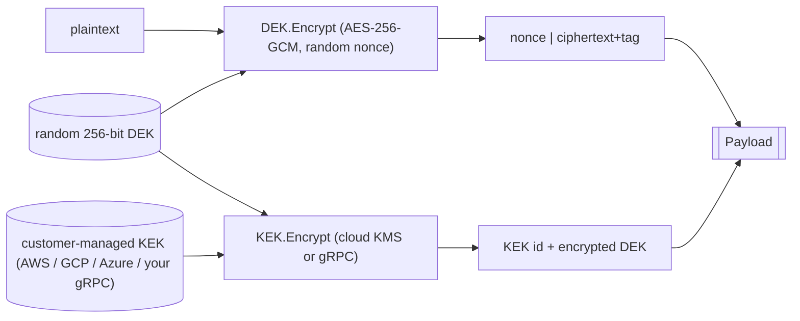
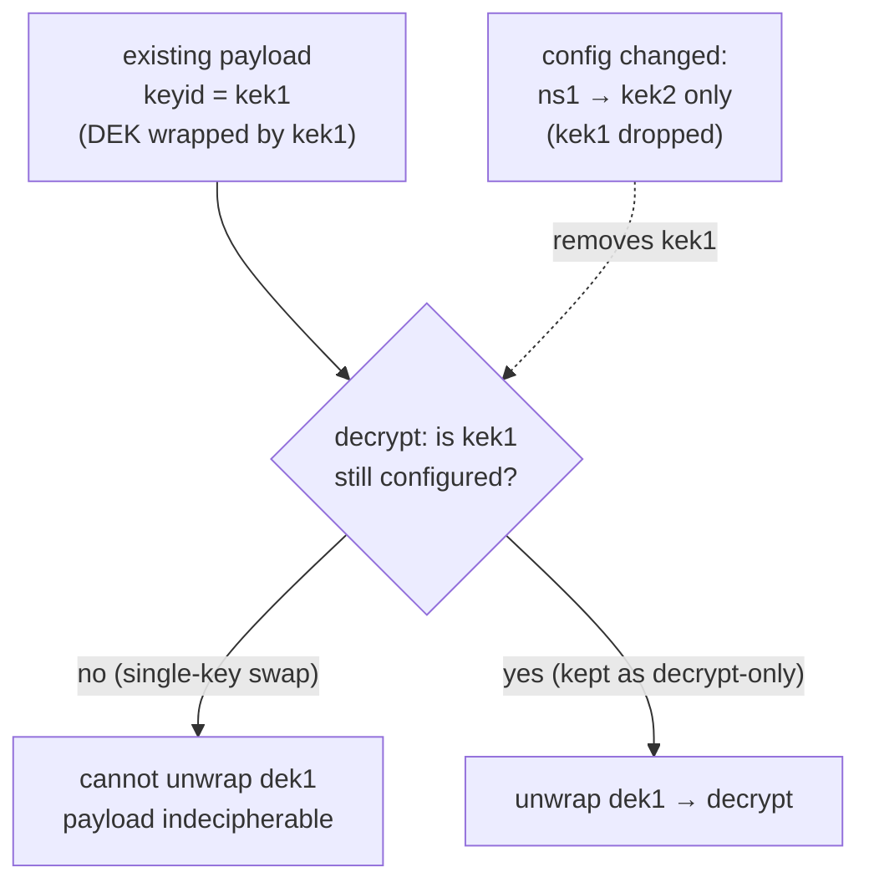
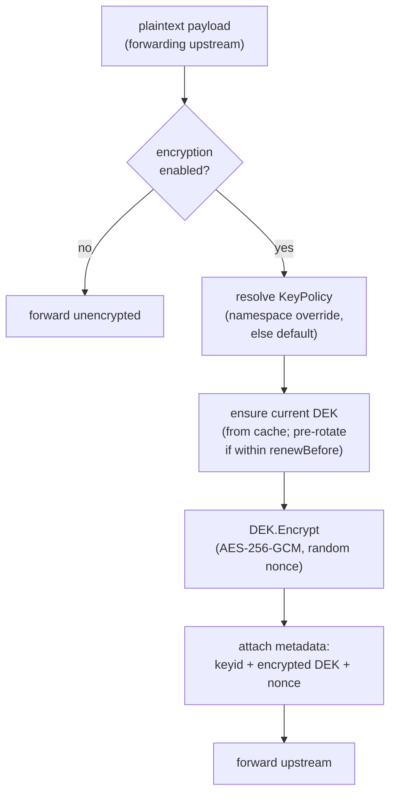
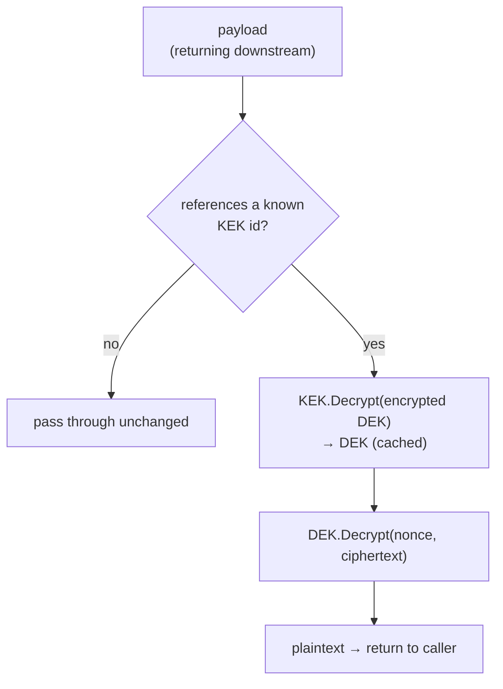

# End to End Encryption of Workflow Data

This RFC outlines a proposal for how the Temporal Proxy will handle encrypting customer data. This includes, at a
minimum, workflow payloads and any memo and header fields.

Questions and feedback can be directed to your Temporal account rep, the proxy team, or the community Slack channel.

- **Slack:** [#proxy](https://temporalio.slack.com/archives/C0BD5MZF6UD)
- **Email:** <proxy@temporal.io>

## Background

To ensure that PII or other private information is never shared outside the Worker pool, all payload data must be
encrypted both in transit and at rest. For some customers this is mandatory, but it will be designed as an opt-in
feature of the proxy.

Today, customers who need this must stand up and operate their own proxy or codec server (or build encryption into every
Worker), then coordinate key management and rotation across many teams. That is friction during onboarding and an
ongoing operational burden. By centralizing encryption at the proxy, operators manage and rotate keys in one place,
transparently to workflow developers.

## Goals and non-goals

There are a number of goals related to encryption, but most notably it must be:

- **Secure:** modern, authenticated encryption with regular key rotation.
- **Transparent:** no special Worker or client configuration; nothing changes for workflow developers.
- **Customer-controlled:** customers own their keys; key material never leaves their cloud provider (or their own KMS
  service).
- **Reliable under rotation:** key rotation must be graceful, and the system must never encrypt something it cannot
  later decrypt.
- **A fail-closed design:** unencrypted data is never proxied or otherwise visible outside the cluster hosting the proxy
  (assuming encryption is enabled).

Non-goals for the initial release:

- Encrypting details that need to be plaintext (e.g. search attributes).
- DEK rotation based on number of uses

## At a glance

- **Scheme:** envelope encryption, where payloads are sealed with a short-lived Data Encryption Key (DEK), which is
  itself wrapped by a customer-managed Key Encryption Key (KEK).
- **Payload cipher:** AES-256-GCM with a random 96-bit nonce per message.
- **KEK sources:** AWS KMS, GCP KMS, Azure Key Vault, an external (often sidecar'ed) gRPC service, plus a `testing://`
  scheme for local development.
- **Granularity:** A default KEK (enforces fail-closed), plus optional namespace-level overrides as needed.
- **DEK rotation:** automatic, time-based, pre-rotated off the hot path.
- **Decryption:** always attempted on any encrypted payload that references a known KEK regardless of whether encryption
  is currently enabled.

> [!NOTE]
>
> **Treat KEK identifiers as immutable.** Once you have encrypted a payload with a given identifier, that identifier
> must remain reachable forever, or the payload becomes indecipherable. See
> [Decommissioning a KEK](#decommissioning-a-kek).

## How it works

The process involves two distinct types of keys: **Key Encryption Keys (KEKs)** and **Data Encryption Keys (DEKs)**. See
[Envelope Encryption](https://en.wikipedia.org/wiki/Hybrid_cryptosystem#Envelope_encryption) for background info.

For our purposes, KEKs are entirely customer-managed/owned, and DEKs are ephemeral, short-lived (configurable), and
managed by the proxy. A locally generated DEK does the actual (symmetric) encryption, while the customer-managed KEK
wraps (encrypts) the DEK. Both the encrypted DEK and the ciphertext travel together in the payload, so the proxy only
needs the KEK to reconstruct the DEK at decrypt time. The proxy never holds KEK material itself, rather it asks the KMS
(or your gRPC service) to wrap and unwrap the DEK on its behalf.



When using the proxy, all encryption/decryption is completely transparent and managed by the proxy without any special
Worker/client config. The proxy implements `WorkflowService` (and others as necessary) and, when appropriate, encrypts
[Payloads] before forwarding them upstream, decrypting them before returning results downstream.

> [!NOTE]
>
> [Memo] and [Header] field values are already Payload objects and will therefore be encrypted in the same manner
> without any special attention.

[Memo]:
  https://github.com/temporalio/api/blob/8e0453c3a17693d7abb78853c3ccccf0c632e782/temporal/api/common/v1/message.proto#L53
[Header]:
  https://github.com/temporalio/api/blob/8e0453c3a17693d7abb78853c3ccccf0c632e782/temporal/api/common/v1/message.proto#L59
[Payload]:
  https://github.com/temporalio/api/blob/8e0453c3a17693d7abb78853c3ccccf0c632e782/temporal/api/common/v1/message.proto#L32
[Payloads]:
  https://github.com/temporalio/api/blob/8e0453c3a17693d7abb78853c3ccccf0c632e782/temporal/api/common/v1/message.proto#L32

### Why envelope encryption?

In two words: **cost and latency.** Cloud KMS calls are slow and rate-limited. Encrypting every payload directly against
the KMS would burn quota and add a network hop per payload. The envelope means we only call the KMS once per DEK
rotation (per namespace), not once per payload.

We also limit the **blast radius**. A DEK is scoped to one namespace and rotates on a short schedule. If a DEK ever
leaks, exposure is bounded to whatever was encrypted with that DEK during its lifetime. KEKs never leave their source
(KMS or your gRPC service) and therefore cannot be leaked by this system.

### Cryptographic details

| Property   | Value                                             |
| ---------- | ------------------------------------------------- |
| Cipher     | AES-256-GCM                                       |
| DEK size   | 256 bits (32 bytes), `crypto/rand`                |
| Nonce size | 96 bits (12 bytes), `crypto/rand`, per encryption |

GCM is authenticated encryption (AEAD); the auth tag is part of the ciphertext and is verified transparently on open. A
tampered payload fails to decrypt rather than returning garbage.

## Key mapping

Proxy operators define KEKs along with associated DEK lifetime settings, and map them to namespaces.

A **default** key is required whenever encryption is enabled. It guarantees fail-closed behaviour: any namespace without
its own `overrides` entry, including ones created after the proxy started, falls back to the default rather than
silently transmitting plaintext. There is no configuration in which encryption is on but a namespace slips through
unencrypted. Enabling encryption (`enabled: true`) without a `default` is a startup error.

The default alone satisfies the fail-closed goal: point it at one KEK and every namespace is covered. Per-namespace
overrides exist for when a single shared key isn't what you want, and there are a few common reasons to reach for them:

- **Blast radius.** A KEK scopes the damage of a mishap. With one shared key, an accidental deletion or a revoked
  permission takes down encryption for every namespace at once; per-namespace keys contain that to a single tenant.
- **Rate limits and throughput.** Every DEK wrap/unwrap is a request against a specific KMS key, and cloud providers
  enforce per-key (and per-account) quotas. Spreading busy namespaces across separate keys, or even separate providers,
  keeps any one key off its ceiling.
- **Data residency and tenancy.** Namespaces often map to different customers, teams, or jurisdictions. Per-namespace
  keys let you keep an EU tenant's key in an EU KMS, give a customer custody of their own key, or satisfy a contract
  that requires physically separate key material.
- **Independent lifecycle.** Rotation cadence, decommissioning, and access can all be managed per key. You can rotate or
  revoke one namespace's key, or migrate it to a different provider, without touching anyone else's data.

The tradeoff is operational: more keys mean more to provision, rotate, and audit. A sensible default could be to start
with `default` only and add overrides where one of the above actually applies.

When encryption is turned off (`enabled: false`), the configured keys and policies are still loaded, but only the
decrypt path uses them; nothing new is encrypted. Defining keys while leaving encryption disabled is a valid
"decrypt-only" posture (e.g. after disabling encryption but still needing to open older payloads), and the proxy logs a
warning at startup so the half-configured state is obvious.

A simple `namespace → key` mapping would create a problem when _changing_ keys (not rotating key material, but moving to
an entirely new key, e.g. a different cloud provider). Given _ns1_ using _dek1_ (wrapped by _kek1_), updating _ns1_ to
use _kek2_ would make old messages indecipherable; a rollback creates the same issue for anything encrypted between
release and rollback.



For this reason we use a one-to-many `namespace → keys` mapping (same for the default), with one key designated
**active** (used for wrapping DEKs) and the others kept reachable for decryption only:

```yaml
encryption:
  ...
  default:
    # ACTIVE KEK (used for all new encryption)
    uri: testing://-ynIaZzFbAjp9VPgu0Ohk9YeQSLS9ta0m9mtnOnGZqo=
    # OLD ONES (decrypt only)
    decryptOnlyURIs:
      - testing://vRQL-YpK_U44lLNwgAsufmOI-2_lCbQV1LDSdFmcHZ8=
    # How long (max) a DEK stays valid for encryption
    duration: 1h
    # How far ahead of expiry to pre-rotate the DEK
    renewBefore: 15m
```

This bundle of settings (the active key, any decrypt-only keys, and the DEK timing) is what we call a **KeyPolicy**. The
`default` is a KeyPolicy, and so is each per-namespace entry under `overrides`; they share the same shape, differing
only in what they apply to. The complete set of fields is in the [Field reference](#field-reference).

## Encryption

[Payload] encryption occurs automatically based on the proxy configuration. It is implemented as an interceptor that
walks the request/response objects, similar to how namespace translation works.

Payloads have their `Data` field set to the encrypted bytes of the original payload, and their `Metadata` set to include
the encrypted DEK and a reference to the KEK used to decrypt it (along with the nonce and an encoding marker).

### Encryption process



> [!NOTE]
>
> Anytime we encrypt something we must be careful never to encrypt something we cannot decrypt (e.g. storing the wrong
> materials in the payload). Places to watch: concurrent calls to KMS (rotation may have happened upstream), DEK caching
> (prevents unnecessary network calls and rate limits), and KMS calls (delays, timeouts, rate limits, outages).

## Decryption

Similar to encryption, the proxy handles decryption transparently, requiring no Worker/client configuration. To support
both encrypted and plaintext payloads/data blobs, the proxy only attempts to decrypt payloads that reference a known
KEK.

### Decryption process



A decrypted-DEK LRU cache (`cacheSize`) avoids redundant KMS calls, important for busy namespaces where decrypting DEKs
on every message would otherwise hit provider rate limits.

## Key rotation

There are two independent layers of rotation.

### DEK rotation (automatic)

DEKs rotate on the schedule defined by `duration` and `renewBefore`. You don't need to do anything: a background loop
rotates any namespace whose DEK is inside the `renewBefore` window before expiry. The first encryption call after
rotation triggers a single, coalesced KMS call to wrap the new DEK.

Old payloads remain decryptable: their encrypted DEK is still in the payload metadata, and the KEK that wrapped it is
still in the registry. Nothing about DEK rotation invalidates older data.

### KEK rotation (operator-driven)

All supported cloud providers support both manual and automatic (recommended) **key-material rotation**: the provider
generates new key material for future encrypt calls while retaining all old versions for decrypt. This is completely
transparent and requires nothing on our part; we recommend enabling automatic rotation where possible.

To **change keys entirely** (e.g. switch providers) without losing access to existing data, promote a new key to active
and mark the old one decrypt-only in the same config update:

```yaml
encryption:
  default:
    # The new active KEK - used for all new encryption.
    uri: gcpkms://projects/my-project/locations/global/keyRings/codec/cryptoKeys/v2
    # The old KEK - kept reachable so existing payloads can still be opened.
    decryptOnlyURIs:
      - gcpkms://projects/my-project/locations/global/keyRings/codec/cryptoKeys/v1
```

On reload the proxy dials the new KEK as active and the old KEK as decrypt-only. New DEKs are wrapped with the new KEK;
old payloads still carry the old `keyid`, and the decrypt path looks them up against the decrypt-only entry. There is no
limit on how many decrypt-only keys a policy can carry.

> [!IMPORTANT]
>
> Once used, a KEK must remain available at least until after the Temporal Workflow retention period, so previously
> encrypted values stay available to the UI, Workers, etc.

## Decommissioning a KEK

> [!CAUTION]
>
> A KEK can be safely removed **only after every payload it ever wrapped is gone from every system the proxy might
> decrypt for**: Temporal history, visibility, archival storage, and any downstream copies. The proxy has no way to know
> this for you.

Deleting a KEK from the cloud provider before the workflow retention period has lapsed **will result in data loss** and
is **not recoverable**. We cannot decrypt data without the original key material used to wrap the DEK, and neither can
anyone else, including the cloud provider.

If a payload carries `encryption/keyid = X` and `X` is in neither the active nor the decrypt-only list, decryption fails
with `unknown key: X`. Re-adding the KEK to the configuration restores access; if the underlying KMS key itself has been
destroyed, the payload is unrecoverable.

### Checklist before removing a KEK

1. **Audit existing data.** Confirm no live workflow history, visibility record, or archive references the KEK
   identifier you intend to remove. KEK identifiers are visible in payload metadata at `encryption/keyid`: for cloud KMS
   this is the full URI; for gRPC endpoints it's the configured `id`.
2. **Keep the KEK as decrypt-only for a grace period.** Move it to `decryptOnlyURIs` / `decryptOnlyEndpoints` first and
   watch error rates. Only then remove the entry.
3. **Don't destroy the KMS key.** Removing the KEK from the proxy config doesn't destroy the underlying KMS key, which
   is your last line of defence.

> [!NOTE]
>
> It is often safer to remove encrypt **IAM permissions** for a key than to delete it. This lets old messages be
> decrypted while guaranteeing the key is never used for new encryption, useful during a config rollout where old proxy
> versions error on encrypt until they're rolled. Always exercise extreme caution when deleting a KMS key.

We strongly recommend provisioning keys with something like Terraform and setting `prevent_destroy = true` where
supported
([GCP example](https://registry.terraform.io/providers/hashicorp/google/latest/docs/resources/kms_crypto_key#example-usage---kms-crypto-key-basic))
to guard against accidental deletes.

## Configuration reference

This section is the config-level detail: where KEKs come from and exactly how to declare them. It covers the external
gRPC server option, the supported cloud KMS providers, and the full annotated configuration schema.

### External server {#external-server}

The proxy can delegate KEK operations to an external gRPC service you run, instead of (or alongside) a cloud KMS. This
is the right path when you:

- Can't give the proxy direct credentials to a cloud provider (air-gapped networks, on-prem KMS, etc.).
- Need routing logic the built-in cloud backends can't express (e.g. per-tenant accounts with separate credentials).
- Have your own PKI infrastructure you need to integrate with.

The RPC service looks roughly like this:

```protobuf
service KMSService {
  rpc Encrypt(EncryptRequest) returns (EncryptResponse) {}
  rpc Decrypt(DecryptRequest) returns (DecryptResponse) {}
}

message EncryptRequest {
  bytes plaintext = 1;
  string namespace = 2;
}

message EncryptResponse {
  bytes ciphertext = 1;
}

message DecryptRequest {
  bytes ciphertext = 1;
  string namespace = 2;
}

message DecryptResponse {
  bytes plaintext = 1;
}
```

The proxy learns about external servers through the top-level `externalServers` map. Encryption policies then reference
a server by name via the `endpoint.server` field. mTLS is supported via a `tls` block on each `externalServers` entry.

```yaml
externalServers:
  kmsserver:
    address: 127.0.0.1:50051
    # tls: ...   # optional; omit for plaintext

encryption:
  ...
  default:
    endpoint:
      server: kmsserver # reference server by name
      id: kms-default
    duration: 30m
    renewBefore: 5m
```

> [!TIP]
>
> **Run the external server as a sidecar.** Every encrypt/decrypt that isn't served from the DEK cache turns into a
> round trip to the KEK service, so the network distance to it sits on the hot path. Deploying the gRPC service as a
> sidecar in the same Pod (reachable over `127.0.0.1`, as above) keeps that hop on the loopback interface, avoiding
> cross-node or cross-zone latency and keeping KEK material off the network entirely. A shared, remotely-hosted KEK
> service works, but pays a real latency tax under cache-miss pressure (e.g. during DEK rotation or a cache-miss storm).

### Supported KMS providers

- [AWS KMS](https://docs.aws.amazon.com/kms/latest/developerguide/overview.html)
- [GCP KMS](https://docs.cloud.google.com/kms/docs/key-management-service)
- [Azure Key Vault](https://learn.microsoft.com/en-us/azure/key-vault/general/overview)
- An [external gRPC service](#external-server) you run
- Static keys (`testing://`) for local development only

Supported KMS URI schemes:

- `awskms:///arn:aws:kms:REGION:ACCOUNT:key/KEY-ID?region=REGION`
- `gcpkms://projects/PROJECT/locations/LOCATION/keyRings/RING/cryptoKeys/KEY`
- `azurekeyvault://VAULT.vault.azure.net/keys/KEY-NAME/KEY-VERSION`
- `testing://...` (local development only; provides no real security)

The proxy authenticates to each KMS through that provider's standard credential chain, so it uses whatever ambient
credentials the host environment supplies and never needs static keys in its config. On Kubernetes, for example, bind
the proxy's service account to a cloud identity (Workload Identity on Azure/GCP, IRSA or Pod Identity on AWS) so
permissions are granted by the provider. Off Kubernetes, the same SDKs resolve credentials from the host instead: VM or
instance metadata (EC2 instance profiles, GCE service accounts, Azure managed identity), environment variables, or a
mounted credentials file. Either way the proxy holds no KEK material; it only needs permission to call encrypt and
decrypt on the specific crypto keys.

### Field reference

Encryption is configured under the top-level `encryption` block, which references gRPC KEK services declared in the
top-level `externalServers` map (see [External server](#external-server) above). A fully annotated example:

```yaml
# gRPC KEK services the proxy can dial, keyed by name. Optional; only needed
# when a KeyPolicy uses an `endpoint` instead of a cloud KMS `uri`. A policy
# references an entry here via `endpoint.server`, and the dialed connection is
# shared across every policy that names it.
externalServers:
  kmsserver:
    # Address of the gRPC service. Required. Often a localhost sidecar.
    address: 127.0.0.1:50051
    # mTLS settings for the connection. Optional; omit for plaintext.
    # tls: ...

encryption:
  # Whether to encrypt NEW payloads. Optional; defaults to false.
  # Decryption is attempted on any encrypted payload regardless of this flag,
  # so flipping it off does NOT strand data already on the wire.
  enabled: true

  # Size of the decrypted-DEK LRU. Optional; defaults to 100.
  # A value <= 0 disables the cache.
  cacheSize: 100

  # Fallback KeyPolicy for any namespace not listed in `overrides`.
  # REQUIRED when `enabled: true` - this is what makes encryption fail-closed,
  # so no namespace is ever transmitted in plaintext. Optional only when
  # `enabled: false` (decrypt-only posture).
  default:
    # ---- KeyPolicy ----
    # `uri` and `endpoint` are mutually exclusive (XOR) - set exactly one.

    # Cloud KMS URI. Validated against the supported schemes: awskms, gcpkms,
    # azurekeyvault, plus `testing` for local development.
    uri: gcpkms://projects/my-project/locations/global/keyRings/codec/cryptoKeys/v2

    # Pointer to a gRPC KEK service. Mutually exclusive with `uri`.
    # endpoint:
    #   server: kmsserver  # required: name of an entry in `externalServers`;
    #                      # the dialed connection is shared across every
    #                      # policy that references it.
    #   id: kms-default    # required: stable identifier for the KEK, written
    #                      # into every payload it encrypts. Must be globally
    #                      # unique across all active and decrypt-only endpoints
    #                      # and must not change across restarts.

    # Cloud KMS URIs no longer used for new encryption but still reachable
    # to decrypt older payloads. Optional.
    decryptOnlyURIs:
      - gcpkms://projects/my-project/locations/global/keyRings/codec/cryptoKeys/v1

    # gRPC endpoints with the same semantics as `decryptOnlyURIs`. Optional.
    # decryptOnlyEndpoints:
    #   - server: kmsserver
    #     id: kms-old

    # How long a DEK stays valid before rotation. Optional.
    duration: 1h

    # How far ahead of expiry to pre-rotate. Optional; must be < duration.
    renewBefore: 15m

  # Per-namespace policies, keyed by namespace. Each value is a KeyPolicy
  # (same shape as `default`) and takes precedence over `default`. Optional.
  overrides:
    my-namespace:
      uri: awskms:///arn:aws:kms:us-east-1:123456789012:key/abcd-1234?region=us-east-1
      duration: 30m
      renewBefore: 5m
```

> [!IMPORTANT]
>
> `KeyPolicy.uri` and `KeyPolicy.endpoint` are mutually exclusive. Setting both fails validation. Setting neither (with
> `decryptOnly*` empty) marks the policy as "not configured" and the proxy skips wiring it. This is allowed for an
> `overrides` entry (that namespace just falls back to `default`), but the `default` policy itself **must** have an
> active `uri` or `endpoint` whenever `enabled: true`; otherwise startup fails.
>
> **gRPC `KeyEndpoint.id` values must be globally unique** across active and decrypt-only endpoints, and must remain
> stable across restarts. Renaming an id is equivalent to losing the key. Reusing an id across endpoints is rejected at
> startup.

## Security commentary

We believe we're in a good place with respect to best practices: regular rotation of key material, AES-256-GCM/AEAD,
short-lived DEKs, and plaintext keys never leaving the process.

The one sharp edge is irreversible key deletion: deleting a KMS key destroys all data encrypted under it, and by design
Temporal cannot recover it. This is covered in detail under [Decommissioning a KEK](#decommissioning-a-kek); the proxy's
responsibility is to fail gracefully (no panics) when a key is missing, and to make the risk obvious through the docs
and guardrails (e.g. `prevent_destroy = true`).

We'll also test and document the minimum permissions (per cloud provider) needed to provide encryption capabilities, and
include those in the setup docs.

## Observability

### Metrics

| Metric                     | Type      | Labels                                          |
| -------------------------- | --------- | ----------------------------------------------- |
| `encryption_ops_total`     | Counter   | operation (encrypt/decrypt), namespace, result  |
| `encryption_duration_secs` | Histogram | operation, namespace                            |
| `kms_calls_total`          | Counter   | provider (aws/azure/gcp/rpc), operation, result |
| `kms_call_duration_secs`   | Histogram | provider, operation                             |
| `dek_cache_hits_total`     | Counter   | namespace                                       |
| `dek_cache_misses_total`   | Counter   | namespace                                       |
| `dek_cache_size`           | Gauge     | -                                               |

These metrics either lack a namespace label or combine it only with low-cardinality labels, keeping series counts
well-bounded regardless of deployment scale.

### Examples of using these metrics

#### DEK cache hit rate

A drop here is the leading indicator of KMS rate-limit pressure; every cache miss is a KMS call. Split by namespace; if
a namespace's hit rate tanks, check its traffic spike and DEK TTL config.

**PromQL:** `rate(dek_cache_hits_total[5m]) / (rate(dek_cache_hits_total[5m]) + rate(dek_cache_misses_total[5m]))`.

#### KMS error rate

KMS errors cascade into encryption failures and then request failures. Separating by provider distinguishes a provider
outage from a permissions/config problem; correlate with DEK cache hit rate, since a cache-miss storm during a KMS
outage is the worst case.

**PromQL:** `rate(kms_calls_total{result="error"}[5m]) / rate(kms_calls_total[5m])` by provider.

## Operational notes

- **Configuration is validated at startup.** The proxy checks the entire encryption config before serving traffic and
  refuses to start on any problem it can detect up front: a missing `default` while encryption is enabled, both `uri`
  and `endpoint` set on a policy, a malformed or unsupported KMS URI, `renewBefore` not less than `duration`, duplicate
  gRPC `id` values, and similar. The goal is to surface foreseeable mistakes as a clear startup failure rather than as a
  runtime error mid-request.
- **A default key is mandatory when encryption is on.** `enabled: true` without `encryption.default` is a startup error.
  This is deliberate: with encryption enabled, there is no path by which a namespace transmits plaintext: it either
  matches an `overrides` entry or falls back to the default.
- **Disabling encryption does not lose data.** Setting `enabled: false` stops new payloads from being encrypted but
  doesn't stop decryption. As long as the KEKs are still configured, the proxy keeps opening older payloads. Keys
  defined while `enabled: false` are loaded for decryption only, and the proxy logs a warning at startup to flag that
  half-configured state.
- **Restart on config change.** The proxy reads encryption configuration at startup. Adding a KEK, or moving one to
  decrypt-only, requires a restart.
- **`testing://` is not for production.** It's exposed for local development only and provides no real security; the key
  material is in the URL.
- **Per-payload timeout.** Each encrypt/decrypt is bounded to one second; the total deadline scales linearly with the
  number of payloads in a batch.
